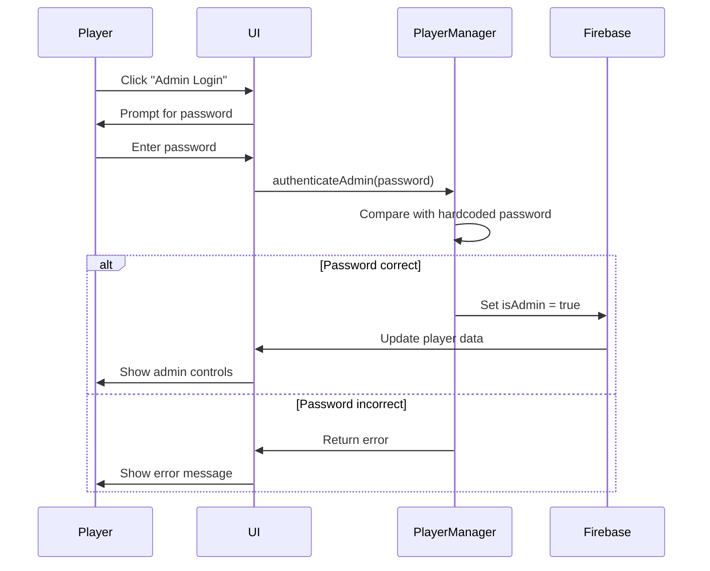

# Design Document: Multiplayer Bidding Quiz Application

## Overview

The Multiplayer Bidding Quiz is a real-time, browser-based game where up to 60 players compete across 10 rounds of trivia questions. Players bid points on their confidence before seeing each question, creating a risk-reward dynamic. The application runs entirely client-side using vanilla JavaScript ES Modules and Firebase Realtime Database for state synchronization, deployable to GitHub Pages without any build process.

### Core Gameplay Flow

1. Players join with unique names (starting with 5000 points)
2. Admin starts the game and triggers the spinning wheel
3. Wheel randomly selects an unused topic
4. Players bid points (30 seconds)
5. Question displays with multiple choice answers (20 seconds)
6. Results show correct answer and score changes (10 seconds)
7. Repeat for 10 rounds total
8. Winner screen displays final rankings

### Key Design Principles

- **Zero Build Process**: All dependencies loaded via CDN, no bundlers or transpilers
- **Client-Side Only**: All logic executes in the browser, Firebase provides real-time sync
- **Modular Architecture**: Separate concerns into focused ES Modules
- **Minimalist Aesthetic**: Pure black and white design with clean typography
- **Performance First**: Optimized for 60 concurrent players with minimal re-renders
- **Graceful Degradation**: Handle disconnections and edge cases smoothly

## Architecture

### System Architecture


### Technology Stack

- **Frontend**: HTML5, CSS3 (Flexbox/Grid), Vanilla JavaScript (ES Modules)
- **Backend**: Firebase Realtime Database (BaaS)
- **Hosting**: GitHub Pages (static hosting)
- **Dependencies**: Firebase SDK 10.7.1 (CDN)
- **Build Tools**: None (direct browser execution)

### Deployment Model

The application is a collection of static files that can be:
1. Opened directly in a browser (file:// protocol)
2. Served from any static web server
3. Deployed to GitHub Pages
4. Hosted on any CDN or static hosting service

No server-side code, no build step, no npm dependencies.

## Components and Interfaces

### Module Structure

#### 1. firebase-config.js

**Purpose**: Firebase initialization and configuration

**Exports**:
```javascript
export const firebaseConfig = {
  apiKey: "...",
  authDomain: "...",
  databaseURL: "...",
  projectId: "...",
  storageBucket: "...",
  messagingSenderId: "...",
  appId: "..."
};

export const db; // Initialized Firebase database reference
```

**Responsibilities**:
- Store Firebase project configuration
- Initialize Firebase app
- Export database reference for other modules

#### 2. game-state.js

**Purpose**: Central game state management and Firebase synchronization

**Exports**:
```javascript
export class GameState {
  constructor(roomId)
  
  // State listeners
  onPhaseChange(callback)
  onRoundChange(callback)
  onPlayersChange(callback)
  onTopicChange(callback)
  
  // State mutations (admin only)
  setPhase(phase)
  startGame()
  triggerWheelSpin()
  advanceToNextRound()
  resetGame()
  
  // State queries
  getCurrentPhase()
  getCurrentRound()
  getCurrentTopic()
  getPlayers()
  getUsedTopics()
  getPhaseStartTime()
  
  // Phase transitions
  transitionToSpinning()
  transitionToBidding()
  transitionToQuestion()
  transitionToResults()
  transitionToFinished()
}
```

**Responsibilities**:
- Listen to Firebase changes and notify subscribers
- Manage phase transitions and timing
- Enforce game rules (10 rounds, phase order)
- Handle admin actions
- Coordinate between modules

**State Machine**:


#### 3. player.js

**Purpose**: Player data management and operations

**Exports**:
```javascript
export class Player {
  constructor(playerId, name)
  
  // Player actions
  submitBid(amount)
  submitAnswer(answerIndex)
  
  // Player queries
  getScore()
  getCurrentBid()
  getCurrentAnswer()
  getName()
  getId()
  
  // Score management
  updateScore(delta)
  resetScore()
}

export class PlayerManager {
  constructor(gameState)
  
  // Player lifecycle
  joinGame(name)
  getPlayer(playerId)
  getAllPlayers()
  getPlayerCount()
  
  // Validation
  isNameTaken(name)
  canPlayerJoin()
  
  // Admin
  isAdmin(playerId)
  authenticateAdmin(password)
}
```

**Responsibilities**:
- Create and manage player instances
- Validate player actions (bid limits, duplicate names)
- Handle player join/disconnect
- Manage admin authentication
- Store player data in Firebase

**Player Data Structure**:
```javascript
{
  playerId: {
    name: "string",
    score: 5000,
    currentBid: 0,
    currentAnswer: null,
    isAdmin: false,
    joinedAt: timestamp
  }
}
```

#### 4. ui.js

**Purpose**: UI rendering and user interaction

**Exports**:
```javascript
export class UIManager {
  constructor(gameState, playerManager)
  
  // Screen rendering
  renderJoinScreen()
  renderGameInterface()
  renderWaitingScreen()
  renderSpinningScreen()
  renderBiddingScreen()
  renderQuestionScreen()
  renderResultsScreen()
  renderWinnerScreen()
  
  // Component rendering
  renderLeaderboard(players)
  renderPhaseIndicator(phase)
  renderTimer(remainingSeconds)
  renderPlayerInfo(player)
  renderAdminControls(isAdmin)
  renderBidSummary(bids)
  renderErrorMessage(message)
  
  // Event handlers
  handleJoinSubmit(name)
  handleBidSubmit(amount)
  handleAnswerSubmit(answerIndex)
  handleAdminAction(action)
  
  // UI utilities
  showLoading()
  hideLoading()
  showError(message)
  clearError()
  disableInput(inputId)
  enableInput(inputId)
}
```

**Responsibilities**:
- Render all UI screens and components
- Handle user input and validation
- Apply black and white minimalist styling
- Manage UI state (loading, errors, disabled inputs)
- Coordinate with game state for updates

**UI Design System** (Black & White Minimalist):
- **Colors**: #000000 (black), #FFFFFF (white), #CCCCCC (subtle gray for borders)
- **Typography**: System fonts, clean sans-serif, generous line-height
- **Spacing**: 8px base unit, multiples for consistency
- **Buttons**: Black background, white text, simple border on hover
- **Inputs**: White background, black border, black text
- **Layout**: Centered content, maximum 1200px width, responsive grid

#### 5. wheel.js

**Purpose**: Spinning wheel animation and topic selection

**Exports**:
```javascript
export class SpinningWheel {
  constructor(topics, usedTopics)
  
  // Animation
  spin()
  stopAt(selectedTopic)
  
  // Rendering
  render(containerElement)
  updateTopics(availableTopics)
  
  // Selection
  selectRandomTopic()
  getAvailableTopics()
}
```

**Responsibilities**:
- Render wheel with 10 topic segments
- Animate spinning with CSS transforms
- Randomly select unused topic
- Update Firebase with selected topic
- Visual feedback during selection

**Wheel Animation**:
- CSS-based rotation using `transform: rotate()`
- Easing function for natural deceleration
- 5-second animation duration
- Random rotation between 1080° and 1800° (3-5 full spins)
- Final position calculated to land on selected topic

**Topics** (Predefined):
1. Science & Technology
2. World History
3. Geography
4. Literature & Arts
5. Sports & Games
6. Music & Entertainment
7. Food & Culture
8. Nature & Animals
9. Mathematics & Logic
10. Current Events

#### 6. timer.js

**Purpose**: Phase countdown timer with client-side calculation

**Exports**:
```javascript
export class PhaseTimer {
  constructor(gameState)
  
  // Timer control
  start(durationSeconds)
  stop()
  reset()
  
  // Timer queries
  getRemainingTime()
  isExpired()
  
  // Callbacks
  onTick(callback)
  onExpire(callback)
  
  // Synchronization
  syncWithServerTime(phaseStartTime)
}
```

**Responsibilities**:
- Calculate remaining time from Firebase phaseStartTime
- Update UI every second
- Trigger phase transitions on expiration
- Handle clock drift and synchronization
- Support different durations per phase

**Timer Implementation**:
```javascript
// Client-side calculation to avoid Firebase writes
const serverStartTime = phaseStartTime; // From Firebase
const localNow = Date.now();
const elapsed = localNow - serverStartTime;
const remaining = phaseDuration - elapsed;
```

**Phase Durations**:
- Spinning: 5 seconds
- Bidding: 30 seconds
- Question: 20 seconds
- Results: 10 seconds
- Waiting: No timer
- Finished: No timer

## Data Models

### Firebase Database Schema

```
rooms/
  {roomId}/
    phase: "waiting" | "spinning" | "bidding" | "question" | "results" | "finished"
    roundNumber: 0-10
    currentTopic: "string"
    phaseStartTime: timestamp (milliseconds)
    usedTopics: ["topic1", "topic2", ...]
    
    players/
      {playerId}/
        name: "string"
        score: number
        currentBid: number
        currentAnswer: number | null
        isAdmin: boolean
        joinedAt: timestamp
    
    rounds/
      {roundNumber}/
        topic: "string"
        question: "string"
        choices: ["A", "B", "C", "D"]
        correctAnswer: number (0-3)
        
        bids/
          {playerId}: number
        
        answers/
          {playerId}: number
        
        results/
          {playerId}/
            correct: boolean
            scoreChange: number
            newScore: number
```

### Question Data Structure

Questions are stored in a local JavaScript object (not in Firebase):

```javascript
const QUESTIONS = {
  "Science & Technology": {
    question: "What year was the first iPhone released?",
    choices: ["2005", "2007", "2009", "2011"],
    correctAnswer: 1
  },
  "World History": {
    question: "In what year did World War II end?",
    choices: ["1943", "1944", "1945", "1946"],
    correctAnswer: 2
  },
  // ... 8 more topics
};
```

### Player State Model

```javascript
class PlayerState {
  playerId: string;        // Unique identifier (UUID)
  name: string;            // Display name (unique per room)
  score: number;           // Current points (starts at 5000)
  currentBid: number;      // Bid for current round (0 if not submitted)
  currentAnswer: number;   // Answer index for current round (null if not submitted)
  isAdmin: boolean;        // Admin privileges flag
  joinedAt: number;        // Timestamp of join
}
```

### Game State Model

```javascript
class GameStateModel {
  phase: Phase;            // Current game phase
  roundNumber: number;     // Current round (0-10)
  currentTopic: string;    // Selected topic for current round
  phaseStartTime: number;  // Timestamp when current phase started
  usedTopics: string[];    // Topics already used in this game
  players: Map<string, PlayerState>;  // All players in the room
}

enum Phase {
  WAITING = "waiting",
  SPINNING = "spinning",
  BIDDING = "bidding",
  QUESTION = "question",
  RESULTS = "results",
  FINISHED = "finished"
}
```

### Round Data Model

```javascript
class RoundData {
  topic: string;
  question: string;
  choices: string[];
  correctAnswer: number;
  bids: Map<string, number>;
  answers: Map<string, number>;
  results: Map<string, RoundResult>;
}

class RoundResult {
  correct: boolean;
  scoreChange: number;
  newScore: number;
}
```


## UI/UX Design

### Design System (Black & White Minimalist)

**Color Palette**:
- Primary: #000000 (pure black)
- Secondary: #FFFFFF (pure white)
- Border: #CCCCCC (subtle gray, used sparingly)
- Disabled: #999999 (medium gray for disabled states)

**Typography**:
- Font Family: -apple-system, BlinkMacSystemFont, "Segoe UI", Roboto, sans-serif
- Headings: 32px (H1), 24px (H2), 18px (H3), bold weight
- Body: 16px, normal weight, 1.6 line-height
- Small: 14px for secondary information
- Monospace: For scores and timers

**Spacing Scale** (8px base unit):
- xs: 4px
- sm: 8px
- md: 16px
- lg: 24px
- xl: 32px
- xxl: 48px

**Layout**:
- Max width: 1200px, centered
- Mobile breakpoint: 768px
- Padding: 16px on mobile, 32px on desktop
- Grid: CSS Grid for main layout, Flexbox for components

**Interactive Elements**:
- Buttons: Black background, white text, 2px white border on hover, 8px padding
- Inputs: White background, 1px black border, 8px padding, black text
- Hover states: Invert colors (black ↔ white)
- Focus states: 2px solid black outline
- Disabled: Gray background, gray text, no pointer events

### Screen Designs

#### 1. Join Screen

**Layout**:
```
┌─────────────────────────────────────┐
│                                     │
│     MULTIPLAYER BIDDING QUIZ        │
│                                     │
│     ┌─────────────────────────┐    │
│     │  Enter your name        │    │
│     └─────────────────────────┘    │
│                                     │
│     [        JOIN GAME        ]    │
│                                     │
│     X players connected             │
│                                     │
└─────────────────────────────────────┘
```

**Elements**:
- Large title (H1) centered at top
- Text input for name (white background, black border)
- Join button (black background, white text)
- Player count display below button
- Error message area (red text on white background if needed)

**Behavior**:
- Input autofocus on load
- Enter key submits form
- Button disabled while submitting
- Error message appears below button for 5 seconds

#### 2. Waiting Screen (Lobby)

**Layout**:
```
┌─────────────────────────────────────┐
│  WAITING FOR GAME TO START          │
│                                     │
│  ┌─────────────────────────────┐   │
│  │  LEADERBOARD                │   │
│  │  1. Player A      5000      │   │
│  │  2. Player B      5000      │   │
│  │  3. You           5000      │   │
│  └─────────────────────────────┘   │
│                                     │
│  X players connected                │
│                                     │
│  [ADMIN: START GAME]                │
└─────────────────────────────────────┘
```

**Elements**:
- Phase indicator at top
- Leaderboard (all players at 5000 points)
- Current player highlighted with border
- Player count
- Admin controls (if admin)

#### 3. Game Interface (Main Screen)

**Layout**:
```
┌─────────────────────────────────────┐
│  Round 3/10 | BIDDING | ⏱ 0:28     │
├─────────────────────────────────────┤
│                                     │
│  Topic: Science & Technology        │
│                                     │
│  Your Score: 6500                   │
│                                     │
│  ┌─────────────────────────────┐   │
│  │  Place your bid:            │   │
│  │  [_____] points             │   │
│  │  [    SUBMIT BID    ]       │   │
│  └─────────────────────────────┘   │
│                                     │
│  ┌─────────────────────────────┐   │
│  │  LEADERBOARD                │   │
│  │  1. Player A      7200      │   │
│  │  2. You           6500      │   │
│  │  3. Player B      5800      │   │
│  └─────────────────────────────┘   │
│                                     │
└─────────────────────────────────────┘
```

**Header Bar** (fixed at top):
- Round number (left)
- Phase name (center)
- Countdown timer (right)
- Black background, white text

**Main Content Area**:
- Current topic (large, centered)
- Player's current score
- Phase-specific content (bid input, question, results)
- Leaderboard (always visible, scrollable if needed)

#### 4. Spinning Wheel Screen

**Layout**:
```
┌─────────────────────────────────────┐
│  Round 3/10 | SPINNING | ⏱ 0:04    │
├─────────────────────────────────────┤
│                                     │
│         ╱───────────╲               │
│       ╱   Science   ╲               │
│      │   History     │              │
│      │   Geography   │              │
│       ╲   Sports    ╱               │
│         ╲─────────╱                 │
│             ▼                       │
│                                     │
│    Selecting topic...               │
│                                     │
└─────────────────────────────────────┘
```

**Elements**:
- Circular wheel divided into 10 segments
- Each segment labeled with topic name
- Pointer/arrow at top center
- Wheel rotates with CSS animation
- Text below indicates "Selecting topic..."

**Animation**:
- Rotation: 1080° to 1800° (3-5 full spins)
- Duration: 5 seconds
- Easing: cubic-bezier(0.25, 0.1, 0.25, 1) for natural deceleration
- Final position calculated to land on selected topic

#### 5. Bidding Screen

**Layout**:
```
┌─────────────────────────────────────┐
│  Round 3/10 | BIDDING | ⏱ 0:28     │
├─────────────────────────────────────┤
│                                     │
│  Topic: Science & Technology        │
│                                     │
│  Your Score: 6500                   │
│                                     │
│  ┌─────────────────────────────┐   │
│  │  How confident are you?     │   │
│  │                             │   │
│  │  Bid amount: [_____]        │   │
│  │                             │   │
│  │  [    SUBMIT BID    ]       │   │
│  │                             │   │
│  │  • Correct: +2x your bid    │   │
│  │  • Wrong: -1x your bid      │   │
│  └─────────────────────────────┘   │
│                                     │
└─────────────────────────────────────┘
```

**Elements**:
- Topic name (large, centered)
- Current score display
- Bid input (number, max = current score)
- Submit button
- Scoring rules reminder (small text)
- Input disabled after submission with "Bid submitted: X points" message

**Validation**:
- Real-time validation on input
- Error message if bid > score or bid ≤ 0
- Button disabled until valid bid entered

#### 6. Question Screen

**Layout**:
```
┌─────────────────────────────────────┐
│  Round 3/10 | QUESTION | ⏱ 0:18    │
├─────────────────────────────────────┤
│                                     │
│  Science & Technology               │
│                                     │
│  What year was the first iPhone     │
│  released?                          │
│                                     │
│  ┌─────────────────────────────┐   │
│  │  [ ] A. 2005                │   │
│  │  [ ] B. 2007                │   │
│  │  [ ] C. 2009                │   │
│  │  [ ] D. 2011                │   │
│  └─────────────────────────────┘   │
│                                     │
│  [    SUBMIT ANSWER    ]            │
│                                     │
│  ┌─────────────────────────────┐   │
│  │  BID SUMMARY                │   │
│  │  You bid: 1000 points       │   │
│  │  Avg bid: 850 points        │   │
│  │  Highest: 2000 points       │   │
│  └─────────────────────────────┘   │
│                                     │
└─────────────────────────────────────┘
```

**Elements**:
- Topic name (small, top)
- Question text (large, readable)
- Answer choices (radio buttons or clickable boxes)
- Submit button
- Bid summary box showing player's bid and aggregate stats
- After submission: "Answer submitted" message, inputs disabled

**Interaction**:
- Click answer choice to select
- Selected choice highlighted with black background, white text
- Submit button enabled only when answer selected
- After submission, all inputs disabled

#### 7. Results Screen

**Layout**:
```
┌─────────────────────────────────────┐
│  Round 3/10 | RESULTS | ⏱ 0:08     │
├─────────────────────────────────────┤
│                                     │
│  ✓ CORRECT!                         │
│  The answer was: B. 2007            │
│                                     │
│  Your bid: 1000 points              │
│  Score change: +2000                │
│  New score: 8500                    │
│                                     │
│  ┌─────────────────────────────┐   │
│  │  LEADERBOARD                │   │
│  │  1. Player A      9200 ↑1   │   │
│  │  2. You           8500 ↑2   │   │
│  │  3. Player B      7800 ↓1   │   │
│  └─────────────────────────────┘   │
│                                     │
└─────────────────────────────────────┘
```

**Elements**:
- Result indicator (✓ CORRECT or ✗ WRONG) - large, centered
- Correct answer display
- Player's bid amount
- Score change (+/- with color: green for positive, red for negative)
- New score (large, bold)
- Updated leaderboard with rank changes (↑↓ arrows)

**Styling**:
- Correct: ✓ symbol, positive score change
- Wrong: ✗ symbol, negative score change
- Rank changes: ↑ for improvement, ↓ for decline, → for no change

#### 8. Winner Screen

**Layout**:
```
┌─────────────────────────────────────┐
│                                     │
│         🏆 GAME OVER 🏆             │
│                                     │
│         WINNER: Player A            │
│         Final Score: 12,500         │
│                                     │
│  ┌─────────────────────────────┐   │
│  │  FINAL RANKINGS             │   │
│  │                             │   │
│  │  1. 🥇 Player A    12,500   │   │
│  │  2. 🥈 You          9,800   │   │
│  │  3. 🥉 Player B     8,200   │   │
│  │  4.    Player C     7,500   │   │
│  │  5.    Player D     6,100   │   │
│  └─────────────────────────────┘   │
│                                     │
│  [ADMIN: RESET GAME]                │
│                                     │
└─────────────────────────────────────┘
```

**Elements**:
- Large "GAME OVER" heading
- Winner announcement with name and score
- Full leaderboard with final rankings
- Medal emojis for top 3 (🥇🥈🥉)
- Admin reset button (if admin)

### Component Designs

#### Leaderboard Component

**Structure**:
```html
<div class="leaderboard">
  <h3>Leaderboard</h3>
  <div class="leaderboard-list">
    <div class="leaderboard-item current-player">
      <span class="rank">1</span>
      <span class="name">You</span>
      <span class="score">6500</span>
      <span class="change">↑2</span>
    </div>
    <!-- More players... -->
  </div>
</div>
```

**Styling**:
- Fixed height with scroll if > 10 players
- Current player highlighted with border
- Rank numbers aligned left
- Scores aligned right, monospace font
- Rank changes shown as arrows (only on results screen)

#### Timer Component

**Structure**:
```html
<div class="timer">
  <span class="timer-icon">⏱</span>
  <span class="timer-value">0:28</span>
</div>
```

**Styling**:
- Monospace font for time value
- Format: M:SS (e.g., 0:05, 1:30)
- Red text when < 10 seconds remaining
- Pulsing animation when < 5 seconds

#### Phase Indicator Component

**Structure**:
```html
<div class="phase-indicator">
  <span class="phase-name">BIDDING</span>
  <span class="phase-instruction">Place your bid</span>
</div>
```

**Styling**:
- Phase name in uppercase, bold
- Instruction text below in smaller font
- Different background colors per phase (all black/white variations)

#### Admin Controls Component

**Structure**:
```html
<div class="admin-controls">
  <h4>Admin Controls</h4>
  <button onclick="startGame()">Start Game</button>
  <button onclick="triggerSpin()">Spin Wheel</button>
  <button onclick="nextPhase()">Next Phase</button>
  <button onclick="resetGame()">Reset Game</button>
</div>
```

**Styling**:
- Bordered box to separate from main content
- Buttons stacked vertically
- Small text label "Admin Controls" at top
- Only visible to authenticated admin

#### Error Message Component

**Structure**:
```html
<div class="error-message">
  <span class="error-icon">⚠</span>
  <span class="error-text">Bid amount exceeds your current score</span>
  <button class="error-dismiss">×</button>
</div>
```

**Styling**:
- Red border, white background
- Fixed position at top of screen
- Auto-dismiss after 5 seconds
- Manual dismiss button (×)
- Slide-in animation from top

### Responsive Design

**Mobile (< 768px)**:
- Single column layout
- Leaderboard collapses to show top 5 + current player
- Wheel size reduced to fit screen
- Font sizes scaled down 10%
- Padding reduced to 16px
- Buttons full width

**Desktop (≥ 768px)**:
- Two column layout: main content (70%) + leaderboard (30%)
- Full leaderboard visible
- Larger wheel size
- Standard font sizes
- 32px padding
- Buttons auto width with min-width

### Accessibility Considerations

- Semantic HTML (headings, buttons, forms)
- ARIA labels for interactive elements
- Keyboard navigation support (Tab, Enter, Space)
- Focus indicators (2px black outline)
- Sufficient color contrast (black on white = 21:1 ratio)
- Text alternatives for icons
- Screen reader announcements for phase changes

## Performance Optimizations

### Firebase Optimization

**Read Optimization**:
- Use `.on('value')` listeners only for frequently changing data (phase, timer)
- Use `.once('value')` for static data (questions, topics)
- Limit listener scope to specific paths (e.g., `players/{playerId}` not entire `players/`)
- Detach listeners when components unmount

**Write Optimization**:
- Batch related writes using Firebase transactions
- Avoid writing on every timer tick (use client-side calculation)
- Use `.update()` instead of `.set()` to modify specific fields
- Debounce rapid user inputs (bid amount typing)

**Data Structure Optimization**:
- Flat structure to minimize data transfer
- Avoid nested arrays (use objects with keys)
- Store only essential data in Firebase
- Keep questions local (not in Firebase)

### UI Rendering Optimization

**Minimize Re-renders**:
- Update only changed DOM elements, not entire screens
- Use `textContent` instead of `innerHTML` when possible
- Cache DOM element references
- Implement virtual DOM diffing for leaderboard updates

**Efficient Leaderboard Updates**:
```javascript
// Bad: Re-render entire leaderboard
function updateLeaderboard(players) {
  leaderboardElement.innerHTML = renderAllPlayers(players);
}

// Good: Update only changed scores
function updateLeaderboard(players) {
  players.forEach(player => {
    const scoreElement = document.getElementById(`score-${player.id}`);
    if (scoreElement.textContent !== player.score.toString()) {
      scoreElement.textContent = player.score;
    }
  });
}
```

**Input Handling**:
- Disable inputs immediately after submission
- Show loading state during Firebase writes
- Prevent double submissions with flag variables
- Validate inputs before writing to Firebase

### Concurrency Handling (60 Players)

**Strategies**:
1. **Optimistic UI Updates**: Update local UI immediately, sync with Firebase asynchronously
2. **Staggered Reads**: Don't fetch all player data at once, paginate if needed
3. **Debounced Listeners**: Batch rapid Firebase updates into single UI update
4. **Lazy Loading**: Load leaderboard data only when visible
5. **Connection Pooling**: Reuse Firebase connection across modules

**Scalability Limits**:
- Firebase Realtime Database: 100,000 concurrent connections per database
- 60 players = well within limits
- Each player: ~5-10 active listeners
- Total: ~300-600 concurrent listeners (acceptable)

### Memory Management

- Remove event listeners on component unmount
- Clear intervals/timeouts when phase changes
- Avoid memory leaks in closures
- Use WeakMap for player references if needed

## Timer Implementation

### Client-Side Calculation

The timer uses client-side calculation based on a server timestamp to avoid continuous Firebase writes:

```javascript
class PhaseTimer {
  constructor(phaseDuration) {
    this.duration = phaseDuration * 1000; // Convert to milliseconds
    this.startTime = null;
    this.intervalId = null;
  }
  
  start(serverStartTime) {
    this.startTime = serverStartTime;
    
    // Update every 100ms for smooth countdown
    this.intervalId = setInterval(() => {
      const now = Date.now();
      const elapsed = now - this.startTime;
      const remaining = Math.max(0, this.duration - elapsed);
      
      this.onTick(Math.ceil(remaining / 1000));
      
      if (remaining <= 0) {
        this.stop();
        this.onExpire();
      }
    }, 100);
  }
  
  stop() {
    if (this.intervalId) {
      clearInterval(this.intervalId);
      this.intervalId = null;
    }
  }
  
  onTick(secondsRemaining) {
    // Override in implementation
  }
  
  onExpire() {
    // Override in implementation
  }
}
```

### Synchronization Strategy

**Initial Sync**:
1. Admin triggers phase change
2. Firebase writes new `phaseStartTime` (server timestamp)
3. All clients receive `phaseStartTime` via listener
4. Each client starts local timer using `phaseStartTime`

**Clock Drift Handling**:
- Accept minor drift (< 1 second) as acceptable
- Clients may expire at slightly different times
- Phase transition triggered by first client to expire (admin preferred)
- Other clients sync to new phase via Firebase listener

**Edge Cases**:
- **Late Joiner**: Receives current `phaseStartTime`, calculates remaining time
- **Disconnection**: On reconnect, recalculates remaining time from `phaseStartTime`
- **Tab Inactive**: Timer continues in background, UI updates on tab focus
- **Clock Skew**: Use Firebase server timestamp, not client clock

### Phase-Specific Timers

```javascript
const PHASE_DURATIONS = {
  waiting: null,      // No timer
  spinning: 5,        // 5 seconds
  bidding: 30,        // 30 seconds
  question: 20,       // 20 seconds
  results: 10,        // 10 seconds
  finished: null      // No timer
};
```

### Auto-Transition Logic

```javascript
function onTimerExpire(currentPhase) {
  switch (currentPhase) {
    case 'spinning':
      transitionToBidding();
      break;
    case 'bidding':
      transitionToQuestion();
      break;
    case 'question':
      calculateResults();
      transitionToResults();
      break;
    case 'results':
      if (roundNumber < 10) {
        incrementRound();
        transitionToSpinning();
      } else {
        transitionToFinished();
      }
      break;
  }
}
```

## Admin Controls and Authentication

### Authentication Flow



### Hardcoded Admin Password

```javascript
// In player.js
const ADMIN_PASSWORD = "quiz2024"; // Change before deployment

export function authenticateAdmin(playerId, password) {
  if (password === ADMIN_PASSWORD) {
    // Set admin flag in Firebase
    db.ref(`rooms/${roomId}/players/${playerId}/isAdmin`).set(true);
    return true;
  }
  return false;
}
```

**Security Note**: This is client-side only and can be bypassed. For production, use Firebase Authentication and Security Rules.

### Admin Control Functions

```javascript
// Admin-only actions
export class AdminControls {
  constructor(gameState, playerId) {
    this.gameState = gameState;
    this.playerId = playerId;
  }
  
  async startGame() {
    if (!this.isAdmin()) return;
    await this.gameState.setPhase('spinning');
    await this.gameState.setRound(1);
  }
  
  async triggerWheelSpin() {
    if (!this.isAdmin()) return;
    // Wheel animation triggers automatically on 'spinning' phase
    // This is a manual override if needed
    await this.gameState.transitionToSpinning();
  }
  
  async nextPhase() {
    if (!this.isAdmin()) return;
    const currentPhase = this.gameState.getCurrentPhase();
    // Transition to next phase in sequence
    await this.gameState.advancePhase();
  }
  
  async resetGame() {
    if (!this.isAdmin()) return;
    await this.gameState.resetGame();
  }
  
  isAdmin() {
    const player = this.gameState.getPlayer(this.playerId);
    return player && player.isAdmin;
  }
}
```

### Admin UI Controls

Admin controls appear as a fixed panel (bottom-right on desktop, bottom on mobile):

```html
<div class="admin-panel">
  <h4>Admin Controls</h4>
  <button onclick="adminControls.startGame()">Start Game</button>
  <button onclick="adminControls.triggerWheelSpin()">Spin Wheel</button>
  <button onclick="adminControls.nextPhase()">Next Phase</button>
  <button onclick="adminControls.resetGame()">Reset Game</button>
  <div class="admin-info">
    <p>Phase: <span id="admin-phase">waiting</span></p>
    <p>Round: <span id="admin-round">0</span>/10</p>
  </div>
</div>
```

**Styling**:
- Semi-transparent black background
- White text and borders
- Fixed position, z-index above other content
- Collapsible on mobile to save space


## Error Handling

### Error Categories

**1. Firebase Connection Errors**
- Connection timeout
- Network disconnection
- Authentication failure
- Permission denied

**Handling Strategy**:
- Display user-friendly error message
- Attempt automatic reconnection (3 retries with exponential backoff)
- Provide manual "Retry Connection" button
- Preserve local state during reconnection

**2. Validation Errors**
- Duplicate player name
- Bid exceeds current score
- Bid is zero or negative
- Invalid answer selection

**Handling Strategy**:
- Display specific error message inline
- Highlight invalid input field
- Allow user to correct and resubmit
- Auto-dismiss after 5 seconds or manual dismiss

**3. State Synchronization Errors**
- Phase mismatch between clients
- Missing player data
- Corrupted round data

**Handling Strategy**:
- Re-fetch state from Firebase
- Log error to console for debugging
- Display generic "Sync error, refreshing..." message
- Automatic page reload if unrecoverable

**4. Disconnection Handling**
- Player disconnects mid-game
- Admin disconnects
- Multiple simultaneous disconnections

**Handling Strategy**:
- Retain player data in Firebase
- Continue game for remaining players
- Allow reconnection with same Player_ID
- Don't block phase transitions on disconnected players

### Error UI Component

```javascript
class ErrorHandler {
  constructor() {
    this.errorContainer = document.getElementById('error-container');
    this.dismissTimeout = null;
  }
  
  showError(message, type = 'error', duration = 5000) {
    // Clear existing error
    this.clearError();
    
    // Create error element
    const errorEl = document.createElement('div');
    errorEl.className = `error-message error-${type}`;
    errorEl.innerHTML = `
      <span class="error-icon">⚠</span>
      <span class="error-text">${message}</span>
      <button class="error-dismiss" onclick="errorHandler.clearError()">×</button>
    `;
    
    this.errorContainer.appendChild(errorEl);
    
    // Auto-dismiss
    if (duration > 0) {
      this.dismissTimeout = setTimeout(() => this.clearError(), duration);
    }
  }
  
  clearError() {
    this.errorContainer.innerHTML = '';
    if (this.dismissTimeout) {
      clearTimeout(this.dismissTimeout);
      this.dismissTimeout = null;
    }
  }
  
  showConnectionError() {
    this.showError('Connection lost. Attempting to reconnect...', 'warning', 0);
  }
  
  showValidationError(field, message) {
    this.showError(`${field}: ${message}`, 'error', 5000);
  }
}
```

### Edge Cases

**1. Late Joiner During Active Game**
- Scenario: Player tries to join while game is in progress
- Handling: Reject join with message "Game in progress. Please wait for next game."

**2. All Players Disconnect**
- Scenario: All players lose connection simultaneously
- Handling: Game state preserved in Firebase, resumes when players reconnect

**3. Admin Disconnects**
- Scenario: Admin loses connection during game
- Handling: Game continues with auto-transitions, admin can reconnect and regain control

**4. Timer Expires During Disconnection**
- Scenario: Player disconnects, timer expires, player reconnects
- Handling: Player sees current phase, missed their chance to bid/answer

**5. Duplicate Player IDs (UUID Collision)**
- Scenario: Extremely rare UUID collision
- Handling: Regenerate UUID and retry join

**6. Zero Players Remaining**
- Scenario: All players disconnect or close browser
- Handling: Game state preserved, can be resumed or reset by admin

**7. Negative Score**
- Scenario: Player bids more than they have (validation bypassed)
- Handling: Allow negative scores, player can recover in future rounds

**8. Simultaneous Admin Actions**
- Scenario: Multiple admins trigger actions at same time
- Handling: Firebase handles with last-write-wins, may cause unexpected state

**9. Browser Tab Inactive**
- Scenario: Player switches tabs, timer continues
- Handling: Timer runs in background, UI updates on tab focus

**10. Clock Skew Between Clients**
- Scenario: Client clocks differ by several seconds
- Handling: Use Firebase server timestamp, accept minor drift (<1s)

## Testing Strategy

### Dual Testing Approach

The application will use both unit tests and property-based tests for comprehensive coverage:

**Unit Tests**: Verify specific examples, edge cases, and error conditions
- Specific scenarios with known inputs and outputs
- Edge cases (empty inputs, boundary values, error states)
- Integration points between modules
- Mock Firebase for isolated testing

**Property-Based Tests**: Verify universal properties across all inputs
- Generate random valid inputs (players, bids, scores, phases)
- Test properties that should hold for all inputs
- Discover edge cases through randomization
- Minimum 100 iterations per property test

Both approaches are complementary and necessary for comprehensive coverage.

### Property-Based Testing Configuration

**Library**: fast-check (JavaScript property-based testing library)
- Loaded via CDN: https://cdn.jsdelivr.net/npm/fast-check
- Minimum 100 iterations per test (configured with `{ numRuns: 100 }`)
- Each test references its design document property

**Test Tag Format**:
```javascript
// Feature: multiplayer-bidding-quiz, Property 1: Player join creates unique ID with 5000 points
fc.assert(fc.property(...), { numRuns: 100 });
```

### Unit Testing Approach

**Framework**: Mocha + Chai (loaded via CDN)
- Mocha: https://cdn.jsdelivr.net/npm/mocha
- Chai: https://cdn.jsdelivr.net/npm/chai

**Test Organization**:
```
tests/
  unit/
    firebase-config.test.js
    game-state.test.js
    player.test.js
    ui.test.js
    wheel.test.js
    timer.test.js
  property/
    game-state.property.test.js
    player.property.test.js
    scoring.property.test.js
  integration/
    full-game.test.js
```

**Mocking Strategy**:
- Mock Firebase with in-memory object
- Mock DOM elements for UI tests
- Mock timers with sinon.js fake timers

### Test Coverage Goals

- **Unit Tests**: 80% code coverage
- **Property Tests**: All correctness properties implemented
- **Integration Tests**: Full game flow (join → 10 rounds → winner)
- **Manual Tests**: UI/UX, responsive design, accessibility

## Correctness Properties

*A property is a characteristic or behavior that should hold true across all valid executions of a system—essentially, a formal statement about what the system should do. Properties serve as the bridge between human-readable specifications and machine-verifiable correctness guarantees.*

### Property 1: Player Join Creates Unique ID with Initial Score

*For any* set of player names, when players join the game, each player should receive a unique Player_ID and an initial score of exactly 5000 points.

**Validates: Requirements 3.1, 3.2**

### Property 2: Duplicate Names Are Rejected

*For any* player name that already exists in the game, attempting to join with that name should be rejected with an error, and the player should not be added to Firebase.

**Validates: Requirements 3.3**

### Property 3: Join Only Allowed in Waiting Phase

*For any* game phase other than "waiting", attempting to join the game should be rejected, preventing new players from joining mid-game.

**Validates: Requirements 3.4**

### Property 4: Firebase Data Structure Compliance

*For any* game state written to Firebase, the data structure should conform to the schema: rooms/{roomId} containing phase, roundNumber, currentTopic, phaseStartTime, players/{playerId} with name/score/currentBid/currentAnswer, and rounds/{roundNumber} with bids/answers/results.

**Validates: Requirements 2.3, 2.4, 2.5**

### Property 5: Phase Transitions Follow State Machine

*For any* current phase, transitioning to the next phase should follow the defined order: waiting → spinning → bidding → question → results → (spinning or finished), with finished only occurring after round 10.

**Validates: Requirements 4.4**

### Property 6: Phase Changes Persist to Firebase

*For any* phase transition, the new phase should be written to Firebase and all connected clients should receive the update through their listeners.

**Validates: Requirements 4.2, 4.3**

### Property 7: Admin Can Control Phases, Non-Admin Cannot

*For any* player with admin privileges, phase transition actions should succeed and update Firebase. For any player without admin privileges, phase transition actions should be rejected.

**Validates: Requirements 4.5, 4.6, 5.5**

### Property 8: Topics Are Unique Per Game

*For any* sequence of topic selections within a game, no topic should be selected more than once, and all selected topics should be added to the usedTopics list.

**Validates: Requirements 6.2, 7.3, 7.4, 7.5**

### Property 9: Topic Selection From Unused Set

*For any* topic selection, the selected topic should always be from the set of topics not in usedTopics, ensuring only unused topics are chosen.

**Validates: Requirements 7.2**

### Property 10: Round Number Increments Correctly

*For any* completed round, the roundNumber in Firebase should increment by exactly 1, progressing from 0 to 10 over the course of a game.

**Validates: Requirements 6.3**

### Property 11: Bid Validation

*For any* player with score S, submitting a bid B should succeed if and only if 0 < B ≤ S, and the bid should be stored as currentBid in Firebase. Invalid bids should be rejected without modifying Firebase.

**Validates: Requirements 8.2, 8.3, 8.4, 8.6**

### Property 12: Answer Submission Stores Correctly

*For any* valid answer selection (index 0-3), submitting the answer should store it as currentAnswer in Firebase for that player.

**Validates: Requirements 9.3**

### Property 13: Correct Answer Scoring

*For any* player who answers correctly with bid B, their score should increase by exactly 2 × B during the results phase.

**Validates: Requirements 10.1**

### Property 14: Incorrect Answer Scoring

*For any* player who answers incorrectly with bid B, their score should decrease by exactly B during the results phase.

**Validates: Requirements 10.2**

### Property 15: Score Changes Persist to Firebase

*For any* score calculation during the results phase, the updated scores should be written to Firebase for all players who participated in the round.

**Validates: Requirements 10.3, 10.4**

### Property 16: Leaderboard Sorted by Score

*For any* set of players with scores, the leaderboard should display players in descending order by score, with rank numbers assigned sequentially (1, 2, 3, ...).

**Validates: Requirements 11.2, 11.3**

### Property 17: Phase Start Time Recorded

*For any* phase transition, a phaseStartTime timestamp should be written to Firebase marking when the new phase began.

**Validates: Requirements 12.1**

### Property 18: Timer Calculation from Start Time

*For any* phase with duration D and start time T, the remaining time at current time C should be calculated as max(0, D - (C - T)), ensuring consistent countdown across all clients.

**Validates: Requirements 12.2**

### Property 19: Timer Expiration Triggers Transition

*For any* phase with a timer, when the remaining time reaches zero, the game should automatically transition to the next phase according to the state machine.

**Validates: Requirements 12.4**

### Property 20: Player Count Accuracy

*For any* game state, counting the number of player nodes in Firebase should return the exact number of players who have joined, and this count should update when players join or disconnect.

**Validates: Requirements 13.1, 13.3**

### Property 21: Bid Summary Contains All Bids

*For any* set of players who submitted bids, the bid summary should include all submitted bids, allowing aggregate calculations (average, max, min).

**Validates: Requirements 14.2**

### Property 22: Winner Has Highest Score

*For any* set of players at game end, the identified winner should be the player with the maximum score, or one of the players with the maximum score if there's a tie.

**Validates: Requirements 16.2**

### Property 23: Game Reset Restores Initial State

*For any* game state, triggering a reset should set phase to "waiting", roundNumber to 0, clear usedTopics, reset all player scores to 5000, and clear all round data.

**Validates: Requirements 17.2, 17.3, 17.4, 17.5, 17.6**

### Property 24: Disconnection Preserves Player Data

*For any* player who disconnects, their data (name, score, bids, answers) should remain in Firebase, and reconnecting with the same Player_ID should restore their session.

**Validates: Requirements 19.6, 28.1, 28.3**

### Property 25: Phase Transitions Don't Require All Submissions

*For any* phase with a timer (bidding, question), the phase should transition to the next phase when the timer expires, regardless of whether all players have submitted bids or answers.

**Validates: Requirements 28.2, 28.4**

### Property 26: Question Data Structure Validation

*For any* question in the questions object, it should have fields: topic (string), question (string), choices (array with ≥2 elements), and correctAnswer (number 0-3), and each topic should map to exactly one question.

**Validates: Requirements 25.1, 25.2, 25.4**

### Property 27: Sound Preference Persistence

*For any* sound preference setting (enabled/disabled), storing it in local storage and then retrieving it should return the same value (round trip property).

**Validates: Requirements 23.4**

## Implementation Notes

### Firebase Security Rules

While this design focuses on client-side implementation, production deployment requires Firebase Security Rules:

```json
{
  "rules": {
    "rooms": {
      "$roomId": {
        ".read": true,
        ".write": "auth != null",
        "players": {
          "$playerId": {
            ".write": "$playerId === auth.uid || data.child('isAdmin').val() === true"
          }
        },
        "phase": {
          ".write": "root.child('rooms').child($roomId).child('players').child(auth.uid).child('isAdmin').val() === true"
        }
      }
    }
  }
}
```

**Note**: The current design uses client-side validation only. For production, implement Firebase Authentication and proper security rules.

### Performance Considerations

**Firebase Limits**:
- 100,000 concurrent connections per database
- 1,000 writes per second per database
- 100 MB/s download bandwidth

**Our Usage** (60 players):
- ~300-600 concurrent listeners
- ~10-20 writes per second (during active phases)
- Well within Firebase limits

**Optimization Checklist**:
- ✓ Client-side timer calculation (no continuous writes)
- ✓ Scoped listeners (specific paths, not entire database)
- ✓ Debounced UI updates
- ✓ Minimal re-renders
- ✓ Efficient data structure (flat, not nested)

### Browser Compatibility

**Minimum Requirements**:
- ES6 Modules support (Chrome 61+, Firefox 60+, Safari 11+, Edge 16+)
- CSS Grid and Flexbox support (all modern browsers)
- Firebase SDK 10.7.1 compatibility

**Fallbacks**:
- No polyfills required (target modern browsers only)
- Graceful degradation for older browsers (display warning message)

### Deployment Checklist

1. Update Firebase configuration in firebase-config.js
2. Change admin password from default
3. Configure Firebase Security Rules
4. Test on GitHub Pages preview
5. Verify responsive design on mobile devices
6. Test with multiple concurrent users
7. Monitor Firebase usage and costs
8. Set up Firebase Analytics (optional)

### Future Enhancements

**Potential Features** (not in current scope):
- Multiple simultaneous game rooms
- Custom question sets (admin upload)
- Player avatars and profiles
- Chat functionality
- Replay/history of past games
- Difficulty levels (easy/medium/hard questions)
- Team mode (players form teams)
- Power-ups and special abilities
- Integration with external trivia APIs

### Known Limitations

1. **Client-Side Validation**: Can be bypassed by malicious users
2. **Admin Password**: Hardcoded and visible in source code
3. **No Authentication**: Players can impersonate others if they know Player_ID
4. **Single Room**: Only one game can run at a time
5. **Static Questions**: Questions hardcoded, not dynamically loaded
6. **No Persistence**: Game state lost if all players disconnect
7. **Limited Scalability**: Designed for 60 players, not 1000+

These limitations are acceptable for the current use case (small group quiz game) but should be addressed for production deployment.

