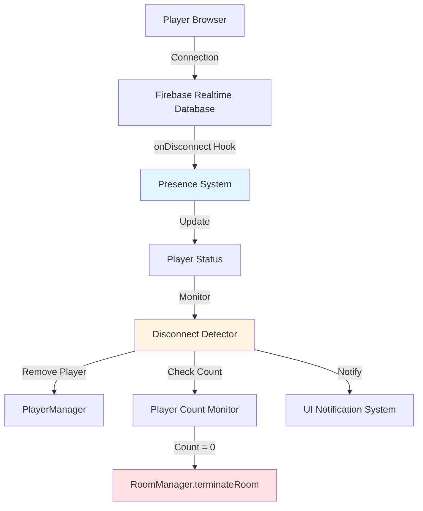
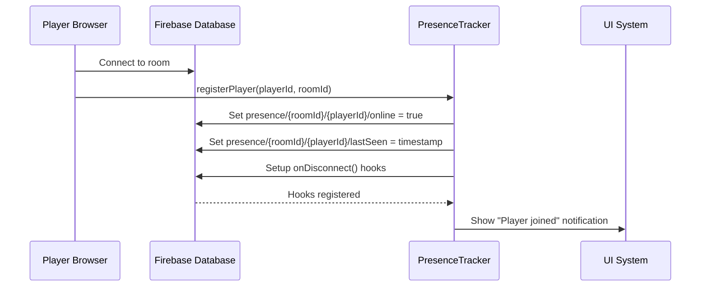
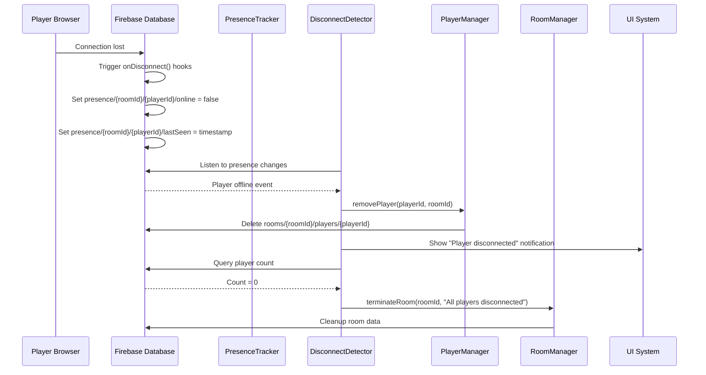
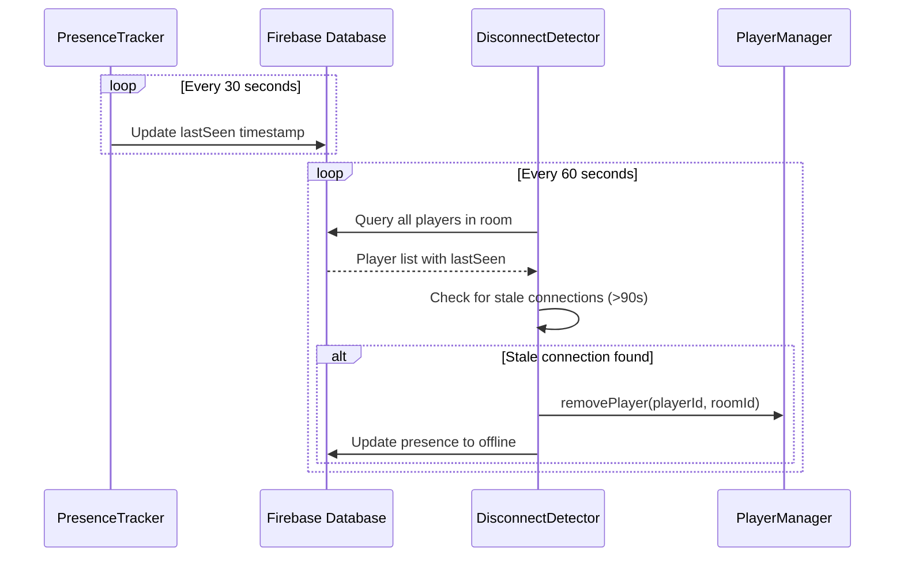

# Design Document: Player Disconnect Detection

## Overview

This feature implements real-time player disconnect detection using Firebase's presence system. When players disconnect (browser close, internet loss, navigation away), they are automatically removed from the active game. If all players leave, the game session terminates automatically. The system provides UI notifications for disconnect events and integrates seamlessly with the existing room management infrastructure.

The design leverages Firebase's `onDisconnect()` API for reliable disconnect detection, tracks player presence with `lastSeen` timestamps, and monitors player count to trigger automatic room termination when empty.

## Architecture



## Sequence Diagrams

### Player Connection Flow



### Player Disconnect Flow



### Heartbeat Monitoring Flow



## Components and Interfaces

### Component 1: PresenceTracker

**Purpose**: Manages player presence state in Firebase and sets up disconnect hooks

**Interface**:
```javascript
class PresenceTracker {
  /**
   * Register a player's presence in the room
   * @param {string} playerId - Player identifier
   * @param {string} roomId - Room identifier
   * @returns {Promise<void>}
   */
  registerPlayer(playerId, roomId): Promise<void>
  
  /**
   * Unregister a player's presence (manual disconnect)
   * @param {string} playerId - Player identifier
   * @param {string} roomId - Room identifier
   * @returns {Promise<void>}
   */
  unregisterPlayer(playerId, roomId): Promise<void>
  
  /**
   * Start heartbeat updates for a player
   * @param {string} playerId - Player identifier
   * @param {string} roomId - Room identifier
   * @returns {void}
   */
  startHeartbeat(playerId, roomId): void
  
  /**
   * Stop heartbeat updates for a player
   * @param {string} playerId - Player identifier
   * @returns {void}
   */
  stopHeartbeat(playerId): void
  
  /**
   * Check if a player is currently online
   * @param {string} playerId - Player identifier
   * @param {string} roomId - Room identifier
   * @returns {Promise<boolean>}
   */
  isPlayerOnline(playerId, roomId): Promise<boolean>
}
```

**Responsibilities**:
- Set up Firebase `onDisconnect()` hooks when players join
- Update `lastSeen` timestamps via heartbeat mechanism
- Mark players as offline when they disconnect
- Provide presence status queries

### Component 2: DisconnectDetector

**Purpose**: Monitors presence changes and triggers player removal and room termination

**Interface**:
```javascript
class DisconnectDetector {
  /**
   * Start monitoring disconnects for a room
   * @param {string} roomId - Room identifier
   * @returns {void}
   */
  startMonitoring(roomId): void
  
  /**
   * Stop monitoring disconnects for a room
   * @param {string} roomId - Room identifier
   * @returns {void}
   */
  stopMonitoring(roomId): void
  
  /**
   * Handle a player disconnect event
   * @param {string} playerId - Player identifier
   * @param {string} roomId - Room identifier
   * @returns {Promise<void>}
   */
  handleDisconnect(playerId, roomId): Promise<void>
  
  /**
   * Check for stale connections (heartbeat timeout)
   * @param {string} roomId - Room identifier
   * @returns {Promise<void>}
   */
  checkStaleConnections(roomId): Promise<void>
  
  /**
   * Get count of active players in room
   * @param {string} roomId - Room identifier
   * @returns {Promise<number>}
   */
  getActivePlayerCount(roomId): Promise<number>
}
```

**Responsibilities**:
- Listen to Firebase presence changes
- Detect when players go offline
- Remove disconnected players from the game
- Monitor player count and trigger room termination
- Check for stale connections via heartbeat timeout

### Component 3: DisconnectNotifier

**Purpose**: Displays UI notifications for disconnect events

**Interface**:
```javascript
class DisconnectNotifier {
  /**
   * Show notification when a player disconnects
   * @param {string} playerName - Name of disconnected player
   * @returns {void}
   */
  notifyPlayerDisconnected(playerName): void
  
  /**
   * Show notification when room is terminating due to no players
   * @returns {void}
   */
  notifyRoomTerminating(): void
  
  /**
   * Show notification when connection is unstable
   * @param {string} playerName - Name of player with unstable connection
   * @returns {void}
   */
  notifyConnectionUnstable(playerName): void
}
```

**Responsibilities**:
- Display toast notifications for disconnect events
- Show warnings for unstable connections
- Notify users when room is terminating

## Data Models

### PresenceData

```javascript
interface PresenceData {
  online: boolean           // Current online status
  lastSeen: number         // Timestamp of last activity (milliseconds)
  connectedAt: number      // Timestamp when player connected
  playerId: string         // Player identifier
  playerName: string       // Player display name
}
```

**Validation Rules**:
- `online` must be boolean
- `lastSeen` must be valid timestamp (> 0)
- `connectedAt` must be valid timestamp (> 0)
- `playerId` must be non-empty string
- `playerName` must be non-empty string

### DisconnectEvent

```javascript
interface DisconnectEvent {
  playerId: string         // Player who disconnected
  playerName: string       // Player display name
  roomId: string          // Room identifier
  timestamp: number       // When disconnect occurred
  reason: string          // Disconnect reason: "connection_lost" | "manual" | "timeout"
}
```

**Validation Rules**:
- All string fields must be non-empty
- `timestamp` must be valid timestamp
- `reason` must be one of the allowed values

## Algorithmic Pseudocode

### Player Registration Algorithm

```pascal
ALGORITHM registerPlayer(playerId, roomId)
INPUT: playerId (string), roomId (string)
OUTPUT: void
PRECONDITION: playerId ≠ ∅ ∧ roomId ≠ ∅
POSTCONDITION: Player presence registered in Firebase with disconnect hooks

BEGIN
  currentTime ← getCurrentTimestamp()
  
  // Create presence data
  presenceData ← {
    online: true,
    lastSeen: currentTime,
    connectedAt: currentTime,
    playerId: playerId,
    playerName: getPlayerName(playerId, roomId)
  }
  
  // Write presence data to Firebase
  presencePath ← "presence/" + roomId + "/" + playerId
  AWAIT writeToFirebase(presencePath, presenceData)
  
  // Set up onDisconnect hooks
  disconnectRef ← getFirebaseRef(presencePath)
  
  // Hook 1: Set online to false
  AWAIT disconnectRef.onDisconnect().update({
    online: false,
    lastSeen: serverTimestamp()
  })
  
  // Hook 2: Remove from active players list
  activePlayersPath ← "presence/" + roomId + "/activePlayers/" + playerId
  AWAIT getFirebaseRef(activePlayersPath).onDisconnect().remove()
  
  // Start heartbeat
  startHeartbeat(playerId, roomId)
  
  ASSERT presenceExists(playerId, roomId) = true
END
```

**Preconditions**:
- `playerId` is non-empty string
- `roomId` is non-empty string
- Player exists in `rooms/{roomId}/players/{playerId}`
- Firebase connection is active

**Postconditions**:
- Presence data written to `presence/{roomId}/{playerId}`
- `onDisconnect()` hooks registered
- Heartbeat timer started
- Player marked as online

**Loop Invariants**: N/A (no loops)

### Disconnect Detection Algorithm

```pascal
ALGORITHM handleDisconnect(playerId, roomId)
INPUT: playerId (string), roomId (string)
OUTPUT: void
PRECONDITION: playerId ≠ ∅ ∧ roomId ≠ ∅
POSTCONDITION: Player removed from game, room terminated if empty

BEGIN
  // Get player info before removal
  playerData ← AWAIT getPlayerData(playerId, roomId)
  
  IF playerData = null THEN
    RETURN  // Player already removed
  END IF
  
  playerName ← playerData.name
  
  // Remove player from game
  AWAIT playerManager.removePlayer(playerId, roomId)
  
  // Remove presence data
  presencePath ← "presence/" + roomId + "/" + playerId
  AWAIT removeFromFirebase(presencePath)
  
  // Stop heartbeat
  stopHeartbeat(playerId)
  
  // Show notification
  notifier.notifyPlayerDisconnected(playerName)
  
  // Check remaining player count
  activeCount ← AWAIT getActivePlayerCount(roomId)
  
  IF activeCount = 0 THEN
    // No players left, terminate room
    notifier.notifyRoomTerminating()
    AWAIT roomManager.terminateRoom(roomId, "All players disconnected")
  END IF
  
  ASSERT playerExists(playerId, roomId) = false
  ASSERT presenceExists(playerId, roomId) = false
END
```

**Preconditions**:
- `playerId` is non-empty string
- `roomId` is non-empty string
- `playerManager` is initialized
- `roomManager` is initialized

**Postconditions**:
- Player removed from `rooms/{roomId}/players/{playerId}`
- Presence removed from `presence/{roomId}/{playerId}`
- Heartbeat stopped
- UI notification shown
- Room terminated if no players remain

**Loop Invariants**: N/A (no loops)

### Stale Connection Check Algorithm

```pascal
ALGORITHM checkStaleConnections(roomId)
INPUT: roomId (string)
OUTPUT: void
PRECONDITION: roomId ≠ ∅
POSTCONDITION: All stale connections removed

BEGIN
  currentTime ← getCurrentTimestamp()
  staleThreshold ← 90000  // 90 seconds in milliseconds
  
  // Get all presence records for room
  presencePath ← "presence/" + roomId
  presenceRecords ← AWAIT queryFirebase(presencePath)
  
  IF presenceRecords = null THEN
    RETURN  // No players in room
  END IF
  
  // Check each player for stale connection
  FOR EACH playerId IN presenceRecords.keys() DO
    ASSERT playerId ≠ ∅
    
    presence ← presenceRecords[playerId]
    timeSinceLastSeen ← currentTime - presence.lastSeen
    
    // Check if connection is stale
    IF presence.online = true AND timeSinceLastSeen > staleThreshold THEN
      // Connection is stale, treat as disconnect
      AWAIT handleDisconnect(playerId, roomId)
    END IF
    
    ASSERT timeSinceLastSeen ≤ staleThreshold OR presence.online = false
  END FOR
END
```

**Preconditions**:
- `roomId` is non-empty string
- Firebase connection is active

**Postconditions**:
- All players with `lastSeen` > 90 seconds ago are removed
- Disconnect handling triggered for stale connections

**Loop Invariants**:
- All previously checked players either have recent `lastSeen` or are offline
- No stale connections remain in processed subset

### Heartbeat Update Algorithm

```pascal
ALGORITHM updateHeartbeat(playerId, roomId)
INPUT: playerId (string), roomId (string)
OUTPUT: void
PRECONDITION: playerId ≠ ∅ ∧ roomId ≠ ∅ ∧ playerIsRegistered(playerId, roomId)
POSTCONDITION: lastSeen timestamp updated

BEGIN
  currentTime ← getCurrentTimestamp()
  
  // Update lastSeen timestamp
  lastSeenPath ← "presence/" + roomId + "/" + playerId + "/lastSeen"
  AWAIT writeToFirebase(lastSeenPath, currentTime)
  
  ASSERT getLastSeen(playerId, roomId) = currentTime
END
```

**Preconditions**:
- `playerId` is non-empty string
- `roomId` is non-empty string
- Player is registered in presence system
- Firebase connection is active

**Postconditions**:
- `lastSeen` timestamp updated to current time
- Player remains marked as online

**Loop Invariants**: N/A (no loops)

## Key Functions with Formal Specifications

### Function 1: registerPlayer()

```javascript
async function registerPlayer(playerId, roomId)
```

**Preconditions:**
- `playerId` is non-null, non-empty string
- `roomId` is non-null, non-empty string
- Player exists in `rooms/{roomId}/players/{playerId}`
- Firebase database connection is active

**Postconditions:**
- Presence data exists at `presence/{roomId}/{playerId}`
- `presence/{roomId}/{playerId}/online === true`
- `onDisconnect()` hooks are registered
- Heartbeat interval is running
- If operation fails, no partial state is left in database

**Loop Invariants:** N/A

### Function 2: handleDisconnect()

```javascript
async function handleDisconnect(playerId, roomId)
```

**Preconditions:**
- `playerId` is non-null, non-empty string
- `roomId` is non-null, non-empty string
- `playerManager` is initialized and functional
- `roomManager` is initialized and functional

**Postconditions:**
- Player no longer exists in `rooms/{roomId}/players/{playerId}`
- Presence no longer exists at `presence/{roomId}/{playerId}`
- Heartbeat interval is cleared
- UI notification has been displayed
- If `activePlayerCount === 0`, room termination is triggered
- No exceptions are thrown (errors are logged)

**Loop Invariants:** N/A

### Function 3: checkStaleConnections()

```javascript
async function checkStaleConnections(roomId)
```

**Preconditions:**
- `roomId` is non-null, non-empty string
- Firebase database connection is active
- `STALE_THRESHOLD` is defined (90000ms)

**Postconditions:**
- For all players in room: `(currentTime - lastSeen) ≤ STALE_THRESHOLD OR online === false`
- All stale connections have been processed via `handleDisconnect()`
- Function completes without throwing exceptions

**Loop Invariants:**
- For all processed players: connection is not stale OR disconnect has been handled
- Remaining unprocessed players have not been modified

### Function 4: startHeartbeat()

```javascript
function startHeartbeat(playerId, roomId)
```

**Preconditions:**
- `playerId` is non-null, non-empty string
- `roomId` is non-null, non-empty string
- Player is registered in presence system
- No existing heartbeat interval for this `playerId`

**Postconditions:**
- Interval timer is created and stored in `heartbeatIntervals[playerId]`
- Timer fires every 30 seconds
- Each timer execution updates `lastSeen` timestamp
- Function returns immediately (non-blocking)

**Loop Invariants:** N/A

### Function 5: getActivePlayerCount()

```javascript
async function getActivePlayerCount(roomId)
```

**Preconditions:**
- `roomId` is non-null, non-empty string
- Firebase database connection is active

**Postconditions:**
- Returns integer ≥ 0
- Count equals number of players in `rooms/{roomId}/players` where player is not a spectator
- Count does NOT include spectators
- If room doesn't exist, returns 0

**Loop Invariants:** N/A

## Example Usage

```javascript
// Example 1: Player joins room
const presenceTracker = new PresenceTracker(db);
const playerId = "player-123";
const roomId = "room-abc";

// Register player presence
await presenceTracker.registerPlayer(playerId, roomId);
// Result: Presence registered, heartbeat started, disconnect hooks set

// Example 2: Monitor disconnects for a room
const disconnectDetector = new DisconnectDetector(db, playerManager, roomManager);
const notifier = new DisconnectNotifier();

disconnectDetector.setNotifier(notifier);
disconnectDetector.startMonitoring(roomId);
// Result: Listening for presence changes, checking stale connections every 60s

// Example 3: Player manually leaves
await presenceTracker.unregisterPlayer(playerId, roomId);
// Result: Presence removed, heartbeat stopped, disconnect hooks cancelled

// Example 4: Check if player is online
const isOnline = await presenceTracker.isPlayerOnline(playerId, roomId);
if (isOnline) {
  console.log("Player is connected");
} else {
  console.log("Player is offline");
}

// Example 5: Integration with existing PlayerManager
class PlayerManager {
  async addPlayer(playerId, roomId, playerName) {
    // ... existing player creation code ...
    
    // Register presence
    await this.presenceTracker.registerPlayer(playerId, roomId);
  }
  
  async removePlayer(playerId, roomId) {
    // Unregister presence
    await this.presenceTracker.unregisterPlayer(playerId, roomId);
    
    // ... existing player removal code ...
  }
}

// Example 6: Integration with BiddingQuizApp
class BiddingQuizApp {
  constructor(roomId) {
    this.roomId = roomId;
    this.presenceTracker = new PresenceTracker(db);
    this.disconnectDetector = new DisconnectDetector(db, this.playerManager, this.roomManager);
    this.notifier = new DisconnectNotifier();
    
    // Set up disconnect detection
    this.disconnectDetector.setNotifier(this.notifier);
    this.disconnectDetector.startMonitoring(this.roomId);
  }
  
  cleanup() {
    // Stop monitoring when app closes
    this.disconnectDetector.stopMonitoring(this.roomId);
  }
}
```

## Correctness Properties

*A property is a characteristic or behavior that should hold true across all valid executions of a system-essentially, a formal statement about what the system should do. Properties serve as the bridge between human-readable specifications and machine-verifiable correctness guarantees.*

### Property 1: Presence Consistency

For all registered players in any room, presence data must exist in Firebase at the corresponding presence path.

**Validates: Requirement 10.1**

### Property 2: Disconnect Hook Reliability

For all players in any room, when a connection is lost, the player's presence is eventually marked as offline through the Firebase onDisconnect hook.

**Validates: Requirement 2.1**

### Property 3: Room Termination Trigger

For all rooms with active status, when the active player count reaches zero, the room eventually transitions to terminating status.

**Validates: Requirement 4.3**

### Property 4: Heartbeat Freshness

For all players marked as online in any room, the lastSeen timestamp is within the heartbeat interval plus tolerance of the current time.

**Validates: Requirement 6.5**

### Property 5: Stale Connection Removal

For all players in any room, when the lastSeen timestamp exceeds the stale threshold while marked as online, the player is eventually detected and removed from the game.

**Validates: Requirement 3.3**

### Property 6: No Orphaned Presence

For all player and room combinations, when a player does not exist in the room's player list, presence data does not exist for that player.

**Validates: Requirement 10.2**

### Property 7: Spectator Exclusion

For all rooms, the active player count equals the total player count minus the spectator count.

**Validates: Requirements 13.1, 13.4**

## Error Handling

### Error Scenario 1: Firebase Connection Lost During Registration

**Condition**: Network connection fails while registering player presence
**Response**: 
- Catch Firebase error
- Log error with context (playerId, roomId)
- Return error object: `{success: false, error: "Failed to register presence", errorCode: "CONNECTION_ERROR"}`
- Do not start heartbeat
**Recovery**: 
- Caller can retry registration
- If player reconnects, registration will succeed
- Existing disconnect hooks remain active if partially registered

### Error Scenario 2: Disconnect Hook Fails to Trigger

**Condition**: Firebase `onDisconnect()` hook doesn't fire due to edge case
**Response**:
- Stale connection checker detects player after 90 seconds
- `checkStaleConnections()` triggers manual disconnect handling
- Player removed via normal disconnect flow
**Recovery**:
- Automatic recovery via heartbeat timeout
- No manual intervention required
- Room termination still occurs if all players stale

### Error Scenario 3: Player Removal Fails

**Condition**: `playerManager.removePlayer()` throws error during disconnect handling
**Response**:
- Catch error in `handleDisconnect()`
- Log error with full context
- Continue with presence cleanup
- Still check player count and trigger termination if needed
**Recovery**:
- Presence data still removed
- Player marked offline
- Retry can be attempted on next stale connection check

### Error Scenario 4: Room Termination Fails

**Condition**: `roomManager.terminateRoom()` fails when last player disconnects
**Response**:
- Error logged but not thrown
- Room remains in "active" state
- Inactivity tracker will eventually terminate room (10 minutes)
**Recovery**:
- Fallback to existing inactivity termination
- Manual termination via admin UI
- Room cleanup still occurs eventually

### Error Scenario 5: Heartbeat Update Fails

**Condition**: Network error prevents `lastSeen` timestamp update
**Response**:
- Error logged but heartbeat continues
- Next heartbeat attempt in 30 seconds
- If multiple failures, stale connection checker will detect
**Recovery**:
- Automatic retry on next heartbeat
- Stale connection detection provides safety net
- Player not removed unless truly disconnected

### Error Scenario 6: Multiple Rapid Disconnects

**Condition**: All players disconnect within seconds of each other
**Response**:
- Each disconnect handled independently
- Player count checked after each removal
- Room termination triggered on first disconnect that brings count to 0
- Subsequent disconnect handlers see room already terminating
**Recovery**:
- Idempotent termination (checks status before proceeding)
- No duplicate termination attempts
- All players properly cleaned up

## Testing Strategy

### Unit Testing Approach

Test each component in isolation with mocked Firebase:

1. **PresenceTracker Tests**
   - Test `registerPlayer()` creates correct presence data
   - Test `onDisconnect()` hooks are properly set
   - Test `startHeartbeat()` creates interval timer
   - Test `stopHeartbeat()` clears interval
   - Test `unregisterPlayer()` removes presence and cancels hooks
   - Test `isPlayerOnline()` returns correct status

2. **DisconnectDetector Tests**
   - Test `startMonitoring()` sets up Firebase listeners
   - Test `handleDisconnect()` removes player and checks count
   - Test `checkStaleConnections()` detects and removes stale players
   - Test `getActivePlayerCount()` excludes spectators
   - Test room termination triggered when count reaches 0

3. **DisconnectNotifier Tests**
   - Test `notifyPlayerDisconnected()` displays correct message
   - Test `notifyRoomTerminating()` shows termination warning
   - Test `notifyConnectionUnstable()` shows warning

### Property-Based Testing Approach

**Property Test Library**: fast-check (JavaScript)

1. **Property: Presence Consistency**
   - Generate random player/room combinations
   - Register players
   - Assert presence exists for all registered players
   - Unregister players
   - Assert presence removed for all unregistered players

2. **Property: Heartbeat Freshness**
   - Generate random player/room combinations
   - Register players and wait random intervals
   - Assert `lastSeen` is within acceptable range for online players

3. **Property: Stale Connection Detection**
   - Generate random player/room combinations
   - Register players and simulate stale connections (mock old timestamps)
   - Run stale connection check
   - Assert all stale players removed

4. **Property: Room Termination Trigger**
   - Generate random room with N players
   - Disconnect all players
   - Assert room termination triggered exactly once
   - Assert termination reason is "All players disconnected"

### Integration Testing Approach

Test with real Firebase emulator:

1. **Full Disconnect Flow**
   - Create room with multiple players
   - Simulate disconnect for one player (close connection)
   - Verify player removed from game
   - Verify UI notification shown
   - Verify remaining players still active

2. **All Players Disconnect**
   - Create room with multiple players
   - Disconnect all players sequentially
   - Verify room termination triggered
   - Verify all data cleaned up
   - Verify room code mapping removed

3. **Heartbeat and Stale Detection**
   - Create room with players
   - Mock time to simulate 90+ seconds passing
   - Verify stale connection checker removes players
   - Verify disconnect handling triggered

4. **Spectator Exclusion**
   - Create room with players and spectators
   - Disconnect all regular players
   - Verify room terminates (spectators don't count)
   - Disconnect spectators
   - Verify spectators removed but no additional termination

5. **Reconnection Handling**
   - Create room with player
   - Simulate disconnect
   - Simulate reconnect (new presence registration)
   - Verify player re-added to game
   - Verify new disconnect hooks set up

## Performance Considerations

1. **Heartbeat Frequency**: 30-second intervals balance freshness with Firebase write costs
2. **Stale Connection Check**: 60-second intervals prevent excessive queries
3. **Batch Operations**: Use Firebase multi-path updates for atomic presence changes
4. **Listener Efficiency**: Single listener per room for all presence changes
5. **Cleanup Timing**: Immediate disconnect handling prevents ghost players
6. **Memory Management**: Clear intervals and listeners on component cleanup

**Expected Performance**:
- Presence registration: < 200ms
- Disconnect detection: < 5 seconds (Firebase propagation)
- Heartbeat update: < 50ms
- Stale connection check (10 players): < 500ms
- Room termination trigger: < 1 second

## Security Considerations

1. **Firebase Security Rules**: Restrict presence writes to authenticated users only
2. **Presence Data Validation**: Validate all presence data structure before writes
3. **Rate Limiting**: Prevent heartbeat spam with client-side throttling
4. **Spectator Verification**: Verify spectator status before excluding from player count
5. **Termination Authorization**: Only allow termination when player count truly zero

**Recommended Firebase Rules**:
```json
{
  "rules": {
    "presence": {
      "$roomId": {
        "$playerId": {
          ".write": "auth != null && auth.uid == $playerId",
          ".read": true
        }
      }
    }
  }
}
```

## Dependencies

1. **Firebase Realtime Database SDK** (v10.7.1)
   - `onDisconnect()` API
   - `serverTimestamp()` function
   - Real-time listeners

2. **Existing Modules**
   - `RoomManager` - for room termination
   - `PlayerManager` - for player removal
   - `firebase-config.js` - database reference

3. **Browser APIs**
   - `setInterval()` / `clearInterval()` - for heartbeat
   - `Date.now()` - for timestamps

4. **No External Libraries Required** - Pure JavaScript implementation
