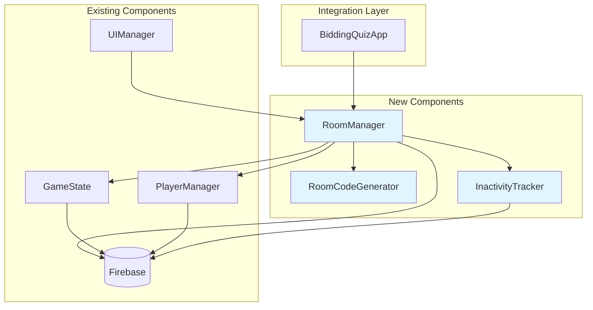
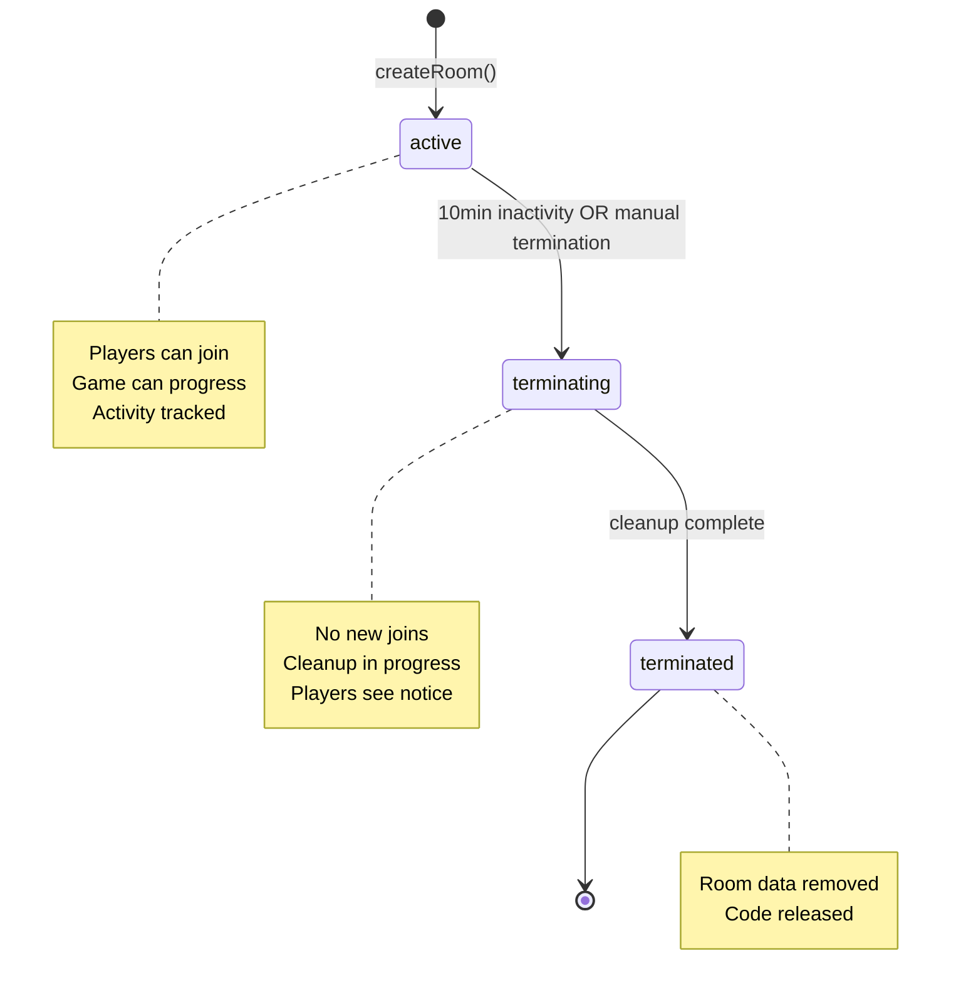

# Design Document: Room Management and Spectator Mode

## Overview

This design specifies a room management system for the multiplayer bidding quiz game that enables users to create and join game rooms using unique 6-character codes, automatically terminates inactive rooms after 10 minutes to optimize Firebase costs, and restricts admin users to spectator-only mode. The system integrates seamlessly with the existing GameState, Player, and UI modules while preserving current game flow and cleanup mechanisms.

The room management system addresses three core needs:
1. **Multi-room support**: Enable multiple concurrent game sessions with unique room codes
2. **Cost optimization**: Automatically clean up inactive rooms to reduce Firebase storage costs
3. **Admin observation**: Allow admins to monitor games without affecting player balance

### Key Design Decisions

- **Room codes use base-32 encoding** (uppercase letters + digits, excluding ambiguous characters) for easy verbal communication and manual entry
- **Inactivity tracking uses Firebase timestamps** to ensure consistency across clients and handle clock skew
- **Spectators stored separately from players** to maintain clean separation and simplify player-only operations
- **Existing cleanup system extended** rather than replaced to preserve tested functionality
- **RoomManager as singleton per room** to centralize room lifecycle management

## Architecture

### System Components



### Component Responsibilities

**RoomManager** (New)
- Create rooms with unique codes
- Validate and process room join requests
- Manage room lifecycle (active → terminating → terminated)
- Coordinate inactivity tracking and automatic termination
- Enforce spectator mode for admin users
- Integrate with existing GameState and PlayerManager

**RoomCodeGenerator** (New)
- Generate cryptographically random 6-character codes
- Ensure uniqueness by checking Firebase before returning
- Use base-32 alphabet excluding ambiguous characters (0, O, 1, I, L)

**InactivityTracker** (New)
- Monitor room activity timestamps in Firebase
- Detect rooms exceeding 10-minute inactivity threshold
- Trigger room termination through RoomManager
- Run as periodic background check (every 60 seconds)

**GameState** (Modified)
- Accept roomId parameter for multi-room support
- Update activity timestamp on phase transitions
- Preserve existing cleanup functionality

**PlayerManager** (Modified)
- Accept roomId parameter for multi-room support
- Update activity timestamp on player actions
- Check spectator status before allowing game actions

**UIManager** (Modified)
- Add room creation/joining screens
- Display room code prominently during game
- Show spectator status indicator for admins
- Handle room termination notifications

## Components and Interfaces

### RoomManager Class

```javascript
export class RoomManager {
  constructor() {
    this.codeGenerator = new RoomCodeGenerator();
    this.inactivityTracker = new InactivityTracker(this);
  }

  /**
   * Create a new game room
   * @returns {Promise<{success: boolean, roomCode?: string, error?: string}>}
   */
  async createRoom() {
    // Generate unique room code
    // Initialize room in Firebase with:
    //   - roomCode
    //   - status: 'active'
    //   - createdAt: timestamp
    //   - lastActivityAt: timestamp
    //   - phase: 'waiting'
    //   - roundNumber: 0
    // Return room code
  }

  /**
   * Join an existing room
   * @param {string} roomCode - 6-character room code
   * @param {string} playerName - Player's display name
   * @param {boolean} isAdmin - Whether player is admin
   * @returns {Promise<{success: boolean, roomId?: string, playerId?: string, error?: string}>}
   */
  async joinRoom(roomCode, playerName, isAdmin = false) {
    // Validate room code format
    // Check if room exists in Firebase
    // Check room status (must be 'active')
    // Check room capacity
    // If isAdmin: add to spectators list
    // If not admin: use PlayerManager to add as player
    // Update lastActivityAt timestamp
    // Return roomId and playerId
  }

  /**
   * Update room activity timestamp
   * @param {string} roomId - Room identifier
   * @returns {Promise<void>}
   */
  async updateActivity(roomId) {
    // Write current timestamp to rooms/{roomId}/lastActivityAt
  }

  /**
   * Mark room for termination
   * @param {string} roomId - Room identifier
   * @param {string} reason - Termination reason
   * @returns {Promise<void>}
   */
  async terminateRoom(roomId, reason) {
    // Set room status to 'terminating'
    // Log termination event
    // Trigger existing cleanup system
    // After cleanup: set status to 'terminated'
  }

  /**
   * Get room information
   * @param {string} roomCode - 6-character room code
   * @returns {Promise<{exists: boolean, roomId?: string, status?: string, error?: string}>}
   */
  async getRoomInfo(roomCode) {
    // Query Firebase for room with this code
    // Return room data if found
  }

  /**
   * Check if user is spectator
   * @param {string} roomId - Room identifier
   * @param {string} userId - User identifier
   * @returns {Promise<boolean>}
   */
  async isSpectator(roomId, userId) {
    // Check if userId exists in rooms/{roomId}/spectators
  }
}
```

### RoomCodeGenerator Class

```javascript
export class RoomCodeGenerator {
  constructor() {
    // Base-32 alphabet excluding ambiguous characters
    this.alphabet = 'ABCDEFGHJKMNPQRSTUVWXYZ23456789';
  }

  /**
   * Generate a unique 6-character room code
   * @returns {Promise<string>} Unique room code
   */
  async generate() {
    // Generate random 6-character code
    // Check uniqueness in Firebase
    // Retry if collision (max 10 attempts)
    // Return unique code
  }

  /**
   * Validate room code format
   * @param {string} code - Code to validate
   * @returns {boolean} True if valid format
   */
  validate(code) {
    // Check length === 6
    // Check all characters in alphabet
    // Return validation result
  }
}
```

### InactivityTracker Class

```javascript
export class InactivityTracker {
  constructor(roomManager) {
    this.roomManager = roomManager;
    this.checkInterval = 60000; // 60 seconds
    this.inactivityThreshold = 600000; // 10 minutes
    this.intervalId = null;
  }

  /**
   * Start monitoring for inactive rooms
   */
  start() {
    // Set up interval to check all rooms
    // Run checkInactiveRooms() every 60 seconds
  }

  /**
   * Stop monitoring
   */
  stop() {
    // Clear interval
  }

  /**
   * Check all active rooms for inactivity
   * @returns {Promise<void>}
   */
  async checkInactiveRooms() {
    // Query all rooms with status 'active'
    // For each room:
    //   - Calculate time since lastActivityAt
    //   - If > 10 minutes: call roomManager.terminateRoom()
  }
}
```

### Integration with Existing Classes

**GameState Modifications**

```javascript
// Constructor now accepts roomId
constructor(roomId = "room1") {
  this.roomId = roomId;
  this.roomManager = null; // Set by app initialization
  // ... existing code
}

// Update activity on phase changes
async setPhase(phase) {
  // ... existing code
  if (this.roomManager) {
    await this.roomManager.updateActivity(this.roomId);
  }
}
```

**PlayerManager Modifications**

```javascript
// Constructor now accepts roomId
constructor(roomId = "room1") {
  this.roomId = roomId;
  this.roomManager = null; // Set by app initialization
  // ... existing code
}

// Check spectator status before actions
async submitBid(playerId, bidAmount) {
  // Check if player is spectator
  if (this.roomManager && await this.roomManager.isSpectator(this.roomId, playerId)) {
    return {
      success: false,
      error: 'Spectators cannot submit bids'
    };
  }
  // ... existing code
}

async submitAnswer(playerId, answerIndex) {
  // Check if player is spectator
  if (this.roomManager && await this.roomManager.isSpectator(this.roomId, playerId)) {
    return {
      success: false,
      error: 'Spectators cannot submit answers'
    };
  }
  // ... existing code
}

// Update activity on player actions
async joinGame(name) {
  // ... existing code
  if (this.roomManager) {
    await this.roomManager.updateActivity(this.roomId);
  }
}
```

**BiddingQuizApp Modifications**

```javascript
constructor(roomId = null) {
  // If no roomId provided, show room selection screen
  this.roomId = roomId;
  this.roomManager = new RoomManager();
  
  if (!roomId) {
    this.showRoomSelection();
  } else {
    this.initializeGame(roomId);
  }
}

showRoomSelection() {
  // Render UI with options:
  // - Create New Room button
  // - Join Existing Room (input + button)
}

async handleCreateRoom() {
  const result = await this.roomManager.createRoom();
  if (result.success) {
    this.initializeGame(result.roomCode);
  }
}

async handleJoinRoom(roomCode, playerName, isAdmin) {
  const result = await this.roomManager.joinRoom(roomCode, playerName, isAdmin);
  if (result.success) {
    this.roomId = result.roomId;
    this.currentPlayerId = result.playerId;
    this.isSpectator = isAdmin;
    this.initializeGame(result.roomId);
  }
}
```

## Data Models

### Firebase Data Structure

```
rooms/
  {roomId}/
    roomCode: "ABC123"           // 6-character unique code
    status: "active"             // active | terminating | terminated
    createdAt: 1234567890        // Unix timestamp
    lastActivityAt: 1234567890   // Unix timestamp
    phase: "waiting"             // Game phase
    roundNumber: 0               // Current round
    phaseStartTime: null         // Phase timer start
    currentTopic: null           // Selected topic
    usedTopics: []               // Array of used topics
    
    players/
      {playerId}/
        name: "Player1"
        score: 5000
        currentBid: 0
        currentAnswer: null
        isAdmin: false
        joinedAt: 1234567890
    
    spectators/
      {userId}/
        name: "Admin1"
        joinedAt: 1234567890
        isAdmin: true
    
    rounds/
      {roundNumber}/
        bids/
          {playerId}: 1000
        answers/
          {playerId}: 2
        results/
          {playerId}/
            correct: true
            scoreChange: 2000
            newScore: 7000

roomCodes/
  "ABC123": "room-uuid-1"        // Map room codes to room IDs
  "XYZ789": "room-uuid-2"
```

### Room Status Lifecycle



### Room Code Format

- **Length**: 6 characters
- **Character set**: `ABCDEFGHJKMNPQRSTUVWXYZ23456789` (30 characters)
- **Excluded characters**: `0` (zero), `O` (letter O), `1` (one), `I` (letter I), `L` (letter L)
- **Total combinations**: 30^6 = 729,000,000 possible codes
- **Collision probability**: Negligible for expected usage (< 10,000 concurrent rooms)

### Activity Tracking Events

Events that update `lastActivityAt` timestamp:
- Room creation
- Player joins room
- Phase transition
- Player submits bid
- Player submits answer
- Admin performs action (start game, advance phase, etc.)

Events that do NOT update activity:
- Spectator joins
- Timer countdown
- Firebase listeners triggering
- UI rendering

## Correctness Properties


*A property is a characteristic or behavior that should hold true across all valid executions of a system—essentially, a formal statement about what the system should do. Properties serve as the bridge between human-readable specifications and machine-verifiable correctness guarantees.*

### Property Reflection

After analyzing all acceptance criteria, the following redundancies were identified:

**Redundant Properties:**
- 1.5 is redundant with 1.1 (both test room code uniqueness)
- 3.2 is redundant with 3.1 (if admin is in spectators, they're not in players)
- 4.1 is redundant with 2.4 (both test activity update on player join)
- 7.4 is largely covered by 7.3 (format validation before database query)

**Combined Properties:**
- 3.4 and 3.5 can be combined into a single property about spectators being unable to perform player actions
- 9.1, 9.2, 9.3, and 9.4 can be combined into a single property about spectator read access to all game data
- 5.4 and 5.5 can be combined into a single property about cleanup removing all room data

After eliminating redundancies, we have 35 unique testable properties.

### Property 1: Room Code Uniqueness

*For any* sequence of room creation requests, all generated room codes should be unique across active rooms.

**Validates: Requirements 1.1, 1.5**

### Property 2: Room Creation Persistence

*For any* generated room code, querying Firebase immediately after creation should return a room with that code.

**Validates: Requirements 1.2**

### Property 3: Initial Room Phase

*For any* newly created room, the game phase should be initialized to 'waiting' (lobby phase).

**Validates: Requirements 1.3**

### Property 4: Creation Timestamp Recording

*For any* newly created room, the room data should contain a createdAt timestamp that is within a reasonable time window of the creation request.

**Validates: Requirements 1.4**

### Property 5: Room Existence Verification

*For any* room code provided to joinRoom(), the system should verify the room exists in Firebase before attempting to add the player.

**Validates: Requirements 2.1**

### Property 6: Non-Existent Room Error

*For any* invalid or non-existent room code, the joinRoom() operation should return an error indicating the room was not found.

**Validates: Requirements 2.2**

### Property 7: Player Addition on Valid Join

*For any* valid room code and player name, successfully joining should result in the player appearing in the room's players list.

**Validates: Requirements 2.3**

### Property 8: Activity Update on Join

*For any* room, when a player joins, the lastActivityAt timestamp should be updated to a value greater than or equal to the previous timestamp.

**Validates: Requirements 2.4, 4.1**

### Property 9: Admin Spectator Assignment

*For any* admin user joining a room, they should be added to the spectators list and not to the players list.

**Validates: Requirements 3.1, 3.2**

### Property 10: Spectator Read Access

*For any* spectator in a room, they should be able to read all game state information including phase, players, questions, bids, and results without errors.

**Validates: Requirements 3.3, 9.1, 9.2, 9.3, 9.4**

### Property 11: Spectator Action Prevention

*For any* spectator attempting to perform player actions (submit bid or answer), the operation should be rejected with an appropriate error message.

**Validates: Requirements 3.4, 3.5**

### Property 12: Spectator Capacity Exclusion

*For any* room, adding spectators should not affect the player count or player capacity calculations.

**Validates: Requirements 3.6**

### Property 13: Activity Update on Player Actions

*For any* player action (bid submission, answer submission), the room's lastActivityAt timestamp should be updated to reflect the action time.

**Validates: Requirements 4.2**

### Property 14: Activity Update on Phase Transition

*For any* game phase transition, the room's lastActivityAt timestamp should be updated to reflect the transition time.

**Validates: Requirements 4.3**

### Property 15: Activity Timestamp Persistence

*For any* activity update, the new timestamp should be persisted to Firebase at the path rooms/{roomId}/lastActivityAt.

**Validates: Requirements 4.4**

### Property 16: Inactivity Duration Calculation

*For any* room with a lastActivityAt timestamp, the calculated inactivity duration should equal the current time minus the lastActivityAt value.

**Validates: Requirements 4.5**

### Property 17: Inactivity Threshold Detection

*For any* room with lastActivityAt older than 10 minutes, the inactivity tracker should mark the room for termination.

**Validates: Requirements 5.2**

### Property 18: Termination Triggers Cleanup

*For any* room marked for termination, the cleanup system should be triggered to remove player and room data.

**Validates: Requirements 5.3**

### Property 19: Cleanup Data Removal

*For any* room undergoing cleanup, all player records and room data should be removed from Firebase.

**Validates: Requirements 5.4, 5.5**

### Property 20: Termination Logging

*For any* room termination, a log entry should be created containing the room code, termination reason, and timestamp.

**Validates: Requirements 5.6**

### Property 21: Finished Phase Cleanup Integration

*For any* room reaching the 'finished' game state, the existing cleanup system should be invoked to handle room removal.

**Validates: Requirements 6.1**

### Property 22: Phase Transition Preservation

*For any* room with the room management system active, all existing phase transitions (waiting → spinning → bidding → question → results → finished) should function correctly.

**Validates: Requirements 6.3**

### Property 23: Manual Cleanup Preservation

*For any* admin-triggered manual cleanup, the existing cleanup controls and logic should execute correctly.

**Validates: Requirements 6.4**

### Property 24: Room Code Length

*For any* generated room code, the length should be exactly 6 characters.

**Validates: Requirements 7.1**

### Property 25: Room Code Character Set

*For any* generated room code, all characters should be from the set of uppercase letters and digits (A-Z, 2-9), excluding ambiguous characters.

**Validates: Requirements 7.2, 7.5**

### Property 26: Format Validation Before Query

*For any* room code provided to joinRoom(), format validation should occur before any Firebase database query is executed.

**Validates: Requirements 7.3, 7.4**

### Property 27: Initial Room Status

*For any* newly created room, the status field should be set to 'active'.

**Validates: Requirements 8.1**

### Property 28: Terminating Status Transition

*For any* room marked for termination, the status should transition from 'active' to 'terminating'.

**Validates: Requirements 8.2**

### Property 29: Terminated Status Finalization

*For any* room completing cleanup, the status should be set to 'terminated' or the room should be removed entirely.

**Validates: Requirements 8.3**

### Property 30: Join Prevention During Termination

*For any* room with status 'terminating', new player join attempts should be rejected with an appropriate error message.

**Validates: Requirements 8.4**

### Property 31: Termination Notice Visibility

*For any* player in a room with status 'terminating', they should be able to view the termination notice through the UI.

**Validates: Requirements 8.5**

### Property 32: Real-Time Spectator Updates

*For any* spectator in a room, when game state changes occur, the spectator's view should receive real-time updates via Firebase listeners.

**Validates: Requirements 9.5**

### Property 33: Room Code Collision Handling

*For any* room code collision detected during generation, the system should regenerate a new code and retry until a unique code is found.

**Validates: Requirements 10.3**

### Property 34: Cleanup Retry on Error

*For any* error occurring during room termination cleanup, the system should log the error and retry the cleanup operation.

**Validates: Requirements 10.4**

### Property 35: Room Code Format Validation

*For any* string input as a room code, the validation function should correctly identify whether it matches the 6-character format with valid characters.

**Validates: Requirements 7.3**

## Error Handling

### Error Categories

**Validation Errors**
- Invalid room code format (not 6 characters, contains invalid characters)
- Empty player name
- Room at capacity
- Invalid admin password

**State Errors**
- Room does not exist
- Room is terminating (cannot join)
- Room is terminated (cannot access)
- Game already in progress (cannot join)
- Player already exists with that name

**Permission Errors**
- Spectator attempting player actions
- Non-admin attempting admin actions
- Unauthorized cleanup attempt

**System Errors**
- Firebase connection failure
- Room code generation collision (after max retries)
- Cleanup failure (after max retries)
- Timestamp synchronization issues

### Error Handling Strategies

**Validation Errors**: Return immediately with descriptive error message, no database operations performed

**State Errors**: Check state before operations, return appropriate error messages, suggest corrective actions

**Permission Errors**: Verify permissions before operations, return clear denial messages, log security-relevant denials

**System Errors**: Implement retry logic with exponential backoff (1s, 2s, 4s), log all attempts, escalate to critical error after max retries, provide fallback UI states

### Error Response Format

```javascript
{
  success: false,
  error: "Human-readable error message",
  errorCode: "ERROR_CODE_CONSTANT",
  retryable: boolean,
  details: {} // Optional additional context
}
```

### Retry Configuration

- **Room code generation**: Max 10 attempts before failure
- **Cleanup operations**: Max 3 attempts with exponential backoff (1s, 2s, 4s)
- **Firebase writes**: Max 3 attempts with exponential backoff
- **Inactivity checks**: Continue indefinitely, log failures but don't stop monitoring

### Critical Error Handling

When max retries are exhausted:
1. Log critical error with full context (room ID, operation, error details)
2. Set room status to 'error' state if applicable
3. Display admin notification in UI
4. Provide manual intervention instructions
5. Send error to monitoring system (if configured)

## Testing Strategy

### Dual Testing Approach

This feature requires both unit tests and property-based tests for comprehensive coverage:

**Unit Tests** focus on:
- Specific examples of room creation and joining
- Edge cases (empty names, invalid codes, capacity limits)
- Error conditions (connection failures, collisions)
- Integration points with existing GameState and PlayerManager
- UI rendering for room selection and spectator mode

**Property-Based Tests** focus on:
- Universal properties across all inputs (code uniqueness, format validation)
- Comprehensive input coverage through randomization (random room codes, player names, timestamps)
- Invariants that must hold (activity timestamps always increase, spectators never in players list)
- Round-trip properties (create room then query should return same room)

### Property-Based Testing Configuration

**Testing Library**: Use `fast-check` for JavaScript property-based testing

**Test Configuration**:
- Minimum 100 iterations per property test
- Each test tagged with feature name and property number
- Tag format: `Feature: room-management-and-spectator-mode, Property {number}: {property_text}`

**Example Property Test Structure**:

```javascript
import fc from 'fast-check';

// Feature: room-management-and-spectator-mode, Property 1: Room Code Uniqueness
test('Property 1: All generated room codes are unique', async () => {
  await fc.assert(
    fc.asyncProperty(
      fc.integer({ min: 2, max: 20 }), // Number of rooms to create
      async (numRooms) => {
        const roomManager = new RoomManager();
        const codes = new Set();
        
        for (let i = 0; i < numRooms; i++) {
          const result = await roomManager.createRoom();
          expect(result.success).toBe(true);
          expect(codes.has(result.roomCode)).toBe(false);
          codes.add(result.roomCode);
        }
        
        expect(codes.size).toBe(numRooms);
      }
    ),
    { numRuns: 100 }
  );
});
```

### Test Coverage Requirements

**Unit Test Coverage**:
- All public methods in RoomManager, RoomCodeGenerator, InactivityTracker
- All error paths and edge cases
- Integration with GameState and PlayerManager
- UI components for room selection and spectator indicators

**Property Test Coverage**:
- All 35 correctness properties defined in this document
- Each property implemented as a single property-based test
- Minimum 100 iterations per test to ensure statistical confidence

### Integration Testing

**Test Scenarios**:
1. Complete room lifecycle: create → join → play → finish → cleanup
2. Multi-room scenario: multiple rooms active simultaneously
3. Inactivity termination: room inactive for 10+ minutes gets cleaned up
4. Spectator mode: admin joins as spectator, cannot perform player actions
5. Capacity limits: room fills up, additional joins rejected
6. Error recovery: connection failures, retries, eventual success

### Manual Testing Checklist

- [ ] Create room and verify code is displayed
- [ ] Join room with valid code
- [ ] Join room with invalid code (verify error)
- [ ] Admin joins as spectator (verify spectator indicator)
- [ ] Spectator attempts to bid (verify rejection)
- [ ] Room becomes inactive for 10 minutes (verify termination)
- [ ] Multiple rooms active simultaneously
- [ ] Room at capacity rejects new joins
- [ ] Existing cleanup system still works after game finish

### Performance Testing

**Metrics to Monitor**:
- Room code generation time (should be < 100ms)
- Room creation time (should be < 500ms)
- Join operation time (should be < 500ms)
- Inactivity check time for 100 rooms (should be < 5s)
- Firebase read/write latency

**Load Testing**:
- 100 concurrent rooms active
- 1000 room codes generated in sequence
- 50 players joining same room simultaneously
- Inactivity tracker monitoring 500 rooms

