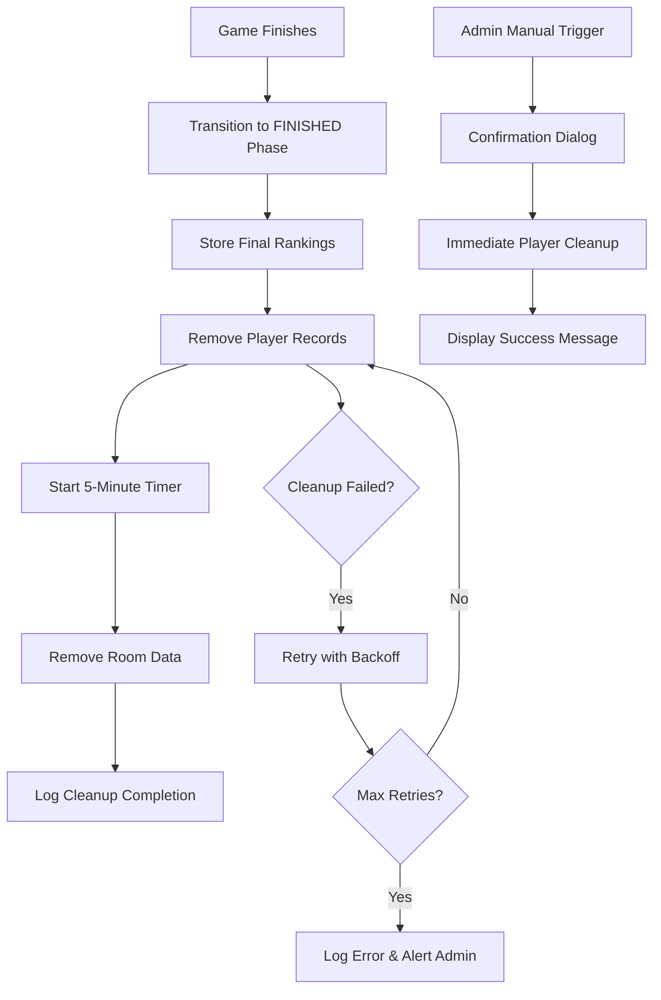

# Design Document: Wheel Improvements and User Cleanup

## Overview

This design enhances the multiplayer bidding quiz game with two primary improvements:

1. **Enhanced Wheel Experience**: Improved visual feedback, animations, accessibility, and performance for the topic selection wheel
2. **Automatic Data Cleanup**: Firebase storage optimization through automatic player and room data cleanup when games finish

The wheel enhancements focus on user experience through better visual indicators, smoother animations with realistic physics, and accessibility improvements for screen reader users. The cleanup system addresses operational costs by automatically removing stale player records and room data from Firebase after game completion.

### Key Design Goals

- Maintain smooth 30+ FPS wheel animations across devices
- Provide clear visual distinction between available and used topics
- Implement automatic cleanup with retry logic for reliability
- Preserve final rankings data for display before full cleanup
- Enable admin controls for manual cleanup operations
- Ensure accessibility compliance with ARIA standards

## Architecture

### Component Structure

The implementation extends two existing modules:

1. **SpinningWheel Module** (`wheel.js`)
   - Enhanced animation system with easing functions
   - Visual feedback system for topic selection
   - Accessibility layer with ARIA live regions
   - Performance-optimized rendering using CSS transforms

2. **GameState Module** (`game-state.js`)
   - Cleanup orchestration system
   - Automatic cleanup triggers on phase transitions
   - Manual cleanup controls for admins
   - Retry logic with exponential backoff

### Data Flow



### Integration Points

- **Firebase Realtime Database**: Primary data store for game state and player records
- **CSS Animation Engine**: Hardware-accelerated transforms for wheel rendering
- **ARIA Live Regions**: Screen reader announcements for accessibility
- **Browser Performance API**: Frame rate monitoring and optimization

## Components and Interfaces

### 1. Enhanced SpinningWheel Class

#### New Properties

```javascript
class SpinningWheel {
  // Existing properties...
  
  // New properties for enhancements
  usedTopics: Set<string>;           // Track used topics
  ariaLiveRegion: HTMLElement;       // ARIA announcements
  highlightTimeout: number;          // Highlight timer ID
  animationFrameId: number;          // RAF ID for performance
  spinStartTime: number;             // Animation timing
  targetRotation: number;            // Final rotation angle
}
```

#### New Methods

```javascript
/**
 * Render wheel with visual distinction for used topics
 * @param {HTMLElement} container - Container element
 * @param {Array<string>} usedTopics - Topics already used
 */
renderWithUsedTopics(container, usedTopics)

/**
 * Highlight the selected topic segment
 * @param {string} topic - Selected topic name
 * @param {number} duration - Highlight duration in ms
 */
highlightSelectedTopic(topic, duration = 2000)

/**
 * Update ARIA live region with announcement
 * @param {string} message - Message to announce
 */
announceToScreenReader(message)

/**
 * Spin wheel with enhanced easing and timing
 * Uses cubic-bezier easing for realistic deceleration
 * @returns {Promise<string>} Selected topic
 */
spinWithEnhancedAnimation()

/**
 * Calculate rotation with improved physics
 * Ensures 3+ full rotations and precise landing
 * @param {string} topic - Target topic
 * @returns {number} Total rotation in degrees
 */
calculateEnhancedRotation(topic)

/**
 * Display topic count overlay
 * Shows "X topics remaining"
 */
updateTopicCountDisplay()
```

#### CSS Classes for Visual States

```css
.wheel-segment--used {
  opacity: 0.4;
  filter: grayscale(60%);
}

.wheel-segment--available {
  opacity: 1.0;
  filter: none;
}

.wheel-segment--selected {
  box-shadow: 0 0 20px rgba(255, 215, 0, 0.8);
  transform: scale(1.05);
  z-index: 10;
}

.wheel--spinning {
  pointer-events: none;
}

.wheel-topic-overlay {
  position: absolute;
  font-size: 2rem;
  font-weight: bold;
  color: #fff;
  text-shadow: 2px 2px 4px rgba(0,0,0,0.8);
}
```

### 2. Cleanup System in GameState Class

#### New Properties

```javascript
class GameState {
  // Existing properties...
  
  // New cleanup properties
  cleanupTimer: number;              // 5-minute timer ID
  cleanupInProgress: boolean;        // Prevent concurrent cleanup
  finalRankingsCache: Array;         // Cached rankings before cleanup
  cleanupRetryCount: number;         // Current retry attempt
  maxCleanupRetries: number;         // Max retry attempts (3)
}
```

#### New Methods

```javascript
/**
 * Automatic cleanup trigger on game finish
 * Called when transitioning to FINISHED phase
 * @returns {Promise<void>}
 */
async triggerAutomaticCleanup()

/**
 * Remove all player records from Firebase
 * Preserves final rankings in cache
 * @returns {Promise<{success: boolean, count: number, error?: string}>}
 */
async cleanupPlayerRecords()

/**
 * Schedule room data cleanup after 5 minutes
 * @returns {void}
 */
scheduleRoomCleanup()

/**
 * Remove all room data except timestamp marker
 * @returns {Promise<{success: boolean, error?: string}>}
 */
async cleanupRoomData()

/**
 * Manual cleanup trigger (admin only)
 * @param {string} playerId - Admin player ID
 * @returns {Promise<{success: boolean, count: number, error?: string}>}
 */
async manualCleanup(playerId)

/**
 * Retry cleanup with exponential backoff
 * @param {Function} cleanupFn - Cleanup function to retry
 * @param {number} attempt - Current attempt number
 * @returns {Promise<any>}
 */
async retryCleanupWithBackoff(cleanupFn, attempt = 0)

/**
 * Get current data usage statistics
 * @returns {Promise<{playerCount: number, roundCount: number}>}
 */
async getDataUsageStats()

/**
 * Cache final rankings before cleanup
 * @returns {Promise<void>}
 */
async cacheFinalRankings()

/**
 * Get cached final rankings
 * @returns {Array} Cached rankings or empty array
 */
getCachedRankings()
```

### 3. Admin UI Controls

New UI components for admin controls:

```html
<!-- Cleanup Control Panel (admin only) -->
<div class="admin-cleanup-panel" id="cleanup-panel">
  <h3>Data Management</h3>
  
  <div class="data-stats">
    <div class="stat">
      <span class="stat-label">Players:</span>
      <span class="stat-value" id="player-count">0</span>
    </div>
    <div class="stat">
      <span class="stat-label">Rounds:</span>
      <span class="stat-value" id="round-count">0</span>
    </div>
  </div>
  
  <button id="manual-cleanup-btn" class="btn-cleanup">
    Cleanup Game Data
  </button>
  
  <div class="cleanup-status" id="cleanup-status"></div>
</div>

<!-- Confirmation Dialog -->
<div class="modal" id="cleanup-confirm-modal">
  <div class="modal-content">
    <h3>Confirm Cleanup</h3>
    <p>This will permanently remove all player records. Continue?</p>
    <button id="confirm-cleanup">Yes, Cleanup</button>
    <button id="cancel-cleanup">Cancel</button>
  </div>
</div>
```

## Data Models

### Firebase Data Structure Changes

#### Before Cleanup
```json
{
  "rooms": {
    "room1": {
      "phase": "finished",
      "roundNumber": 10,
      "currentTopic": "Science & Technology",
      "usedTopics": ["Science & Technology", "World History", ...],
      "phaseStartTime": 1704067200000,
      "players": {
        "player1": {
          "name": "Alice",
          "score": 12500,
          "isAdmin": true
        },
        "player2": {
          "name": "Bob",
          "score": 10800
        }
      },
      "rounds": {
        "1": {
          "topic": "Science & Technology",
          "bids": { "player1": 500, "player2": 300 },
          "answers": { "player1": 2, "player2": 1 },
          "results": { ... }
        },
        // ... rounds 2-10
      }
    }
  }
}
```

#### After Player Cleanup (immediate)
```json
{
  "rooms": {
    "room1": {
      "phase": "finished",
      "roundNumber": 10,
      "currentTopic": "Science & Technology",
      "usedTopics": ["Science & Technology", "World History", ...],
      "phaseStartTime": 1704067200000,
      "players": null,  // Removed
      "rounds": {
        // Still present for 5 minutes
        "1": { ... },
        // ... rounds 2-10
      }
    }
  }
}
```

#### After Room Cleanup (5 minutes later)
```json
{
  "rooms": {
    "room1": {
      "lastCleanedAt": 1704067500000,
      "phase": null,
      "roundNumber": null,
      "currentTopic": null,
      "usedTopics": null,
      "phaseStartTime": null,
      "players": null,
      "rounds": null
    }
  }
}
```

### Cleanup Log Entry Model

```javascript
{
  timestamp: number,           // Unix timestamp
  operation: string,           // "player_cleanup" | "room_cleanup"
  roomId: string,             // Room identifier
  recordsRemoved: number,     // Count of records deleted
  success: boolean,           // Operation success status
  error?: string,             // Error message if failed
  retryAttempt?: number       // Retry attempt number if applicable
}
```

### Wheel State Model

```javascript
{
  isSpinning: boolean,        // Animation in progress
  selectedTopic: string,      // Currently selected topic
  availableTopics: string[],  // Topics not yet used
  usedTopics: string[],       // Topics already used
  highlightActive: boolean,   // Highlight animation active
  spinDuration: number,       // Animation duration (3-7s)
  rotationDegrees: number     // Current rotation angle
}
```


## Correctness Properties

*A property is a characteristic or behavior that should hold true across all valid executions of a system—essentially, a formal statement about what the system should do. Properties serve as the bridge between human-readable specifications and machine-verifiable correctness guarantees.*

### Property 1: Wheel Highlight Duration

*For any* wheel spin operation, when the wheel completes spinning, the selected topic segment SHALL remain highlighted for at least 2 seconds before the highlight is removed.

**Validates: Requirements 1.1**

### Property 2: Spinning Indicator Presence

*For any* time period when the wheel's isSpinning state is true, the wheel element SHALL have a visual spinning indicator class applied.

**Validates: Requirements 1.2**

### Property 3: Topic Overlay Display

*For any* topic selection, after the wheel stops spinning, the topic name SHALL appear in the overlay element's text content.

**Validates: Requirements 1.3**

### Property 4: Distinct Segment Colors

*For any* two different topic segments in the wheel, they SHALL have different color values assigned to ensure visual distinction.

**Validates: Requirements 1.4**

### Property 5: Animation Duration Bounds

*For any* wheel spin operation, the animation duration SHALL be between 3 and 7 seconds inclusive.

**Validates: Requirements 2.2**

### Property 6: Minimum Rotation Requirement

*For any* wheel spin operation, the total rotation in degrees SHALL be at least 1080 degrees (3 full rotations).

**Validates: Requirements 2.3**

### Property 7: Precise Segment Alignment

*For any* wheel spin that selects a topic, the final rotation angle modulo 360 SHALL align with the target topic's segment angle within 1 degree of precision.

**Validates: Requirements 2.4**

### Property 8: Used Topic Visual State

*For any* topic in the used topics list, the corresponding wheel segment SHALL have reduced opacity (< 1.0) or a "used" CSS class applied.

**Validates: Requirements 3.1, 3.2**

### Property 9: Available Topic Count Accuracy

*For any* game state, the displayed count of remaining topics SHALL equal the number of topics in the available topics array.

**Validates: Requirements 3.3**

### Property 10: Player Record Removal

*For any* cleanup operation (automatic or manual), all player records SHALL be removed from the Firebase path `rooms/{roomId}/players`.

**Validates: Requirements 4.1, 6.2**

### Property 11: Rankings Preservation

*For any* player cleanup operation, the cached final rankings SHALL match the player rankings that existed immediately before cleanup.

**Validates: Requirements 4.2**

### Property 12: Cleanup Operation Logging

*For any* successful cleanup operation (player or room), a log entry SHALL be created containing a timestamp and the count of records removed.

**Validates: Requirements 4.3, 5.4**

### Property 13: Cleanup Retry on Failure

*For any* cleanup operation that fails, the system SHALL retry the operation at least once before giving up.

**Validates: Requirements 4.4**

### Property 14: Timed Room Cleanup Trigger

*For any* game that enters FINISHED phase, if the phase remains active for 5 minutes, room data cleanup SHALL be triggered automatically.

**Validates: Requirements 5.1**

### Property 15: Room Data Field Removal

*For any* room cleanup operation, the fields `rounds`, `usedTopics`, `currentTopic`, `phase`, and `roundNumber` SHALL all be set to null in Firebase.

**Validates: Requirements 5.2**

### Property 16: Cleanup Timestamp Preservation

*For any* room cleanup operation, a `lastCleanedAt` field SHALL be written to Firebase with a valid Unix timestamp.

**Validates: Requirements 5.3**

### Property 17: Cleanup Confirmation Dialog

*For any* manual cleanup attempt by an admin, a confirmation dialog SHALL be displayed before the cleanup executes.

**Validates: Requirements 6.3**

### Property 18: Cleanup Success Message

*For any* successful manual cleanup operation, a success message SHALL be displayed containing the number of records removed.

**Validates: Requirements 6.4**

### Property 19: Data Usage Stats Accuracy

*For any* game state, the displayed player count and round count SHALL match the actual counts in Firebase.

**Validates: Requirements 7.1, 7.2**

### Property 20: Real-time Stats Updates

*For any* change to player or round data in Firebase, the data usage display SHALL update to reflect the new values.

**Validates: Requirements 7.3**

### Property 21: Post-Cleanup Stats Update Timing

*For any* cleanup operation, the data usage display SHALL reflect the updated counts within 2 seconds of cleanup completion.

**Validates: Requirements 7.4**

### Property 22: ARIA Live Region Updates

*For any* wheel state change (spinning start, topic selection), the ARIA live region SHALL be updated with an appropriate announcement message.

**Validates: Requirements 8.1, 8.3, 8.4**

### Property 23: ARIA Labels on Interactive Elements

*For any* interactive element in the wheel component, an `aria-label` or `aria-labelledby` attribute SHALL be present.

**Validates: Requirements 8.2**

### Property 24: Animation Frame Rate

*For any* wheel spin animation, the frame rate SHALL remain at or above 30 frames per second throughout the animation duration.

**Validates: Requirements 9.2**

### Property 25: Initial Render Performance

*For any* wheel render operation, the time from render call to DOM ready SHALL be less than 500 milliseconds.

**Validates: Requirements 9.3**

### Property 26: Limited DOM Mutations During Animation

*For any* wheel spin animation, the number of DOM mutations SHALL be minimized to only essential updates (rotation transform updates).

**Validates: Requirements 9.4**

### Property 27: Exponential Backoff Retry

*For any* cleanup operation that fails, retry attempts SHALL use exponential backoff with delays increasing by a factor of 2, up to a maximum of 3 attempts.

**Validates: Requirements 10.1**

### Property 28: Retry Outcome Logging

*For any* cleanup retry operation, the outcome (success or failure) SHALL be logged with the attempt number.

**Validates: Requirements 10.2, 10.3**

### Property 29: Permanent Failure Admin Alert

*For any* cleanup operation that fails after all retry attempts, an error message SHALL be displayed to admins with manual intervention instructions.

**Validates: Requirements 10.4**

## Error Handling

### Wheel Animation Errors

1. **Topic Selection Failure**
   - Scenario: No available topics remain
   - Handling: Display "No topics available" message, disable spin button, log warning
   - Recovery: Admin can reset game to restore topics

2. **Animation Performance Degradation**
   - Scenario: Frame rate drops below 30 FPS
   - Handling: Log performance warning, continue animation with degraded experience
   - Recovery: Suggest browser refresh or device upgrade to user

3. **Firebase Read Failure**
   - Scenario: Cannot fetch used topics from Firebase
   - Handling: Assume all topics available, log error, continue with full topic list
   - Recovery: Retry on next spin operation

### Cleanup Operation Errors

1. **Player Cleanup Failure**
   - Scenario: Firebase write fails during player record deletion
   - Handling: Retry with exponential backoff (delays: 1s, 2s, 4s)
   - Recovery: After 3 failed attempts, log error and alert admin
   - Fallback: Admin can trigger manual cleanup

2. **Room Cleanup Failure**
   - Scenario: Firebase write fails during room data deletion
   - Handling: Retry with exponential backoff
   - Recovery: After 3 failed attempts, log error and alert admin
   - Fallback: Admin can manually delete room data via Firebase console

3. **Partial Cleanup Failure**
   - Scenario: Some player records deleted but not all
   - Handling: Track which records failed, retry only failed records
   - Recovery: Continue retrying failed records independently
   - Logging: Log partial success with list of failed record IDs

4. **Timer Scheduling Failure**
   - Scenario: 5-minute cleanup timer fails to start
   - Handling: Log error, attempt to reschedule timer
   - Recovery: Admin can trigger manual cleanup immediately
   - Monitoring: Log timer start/stop events for debugging

### Admin Control Errors

1. **Permission Verification Failure**
   - Scenario: Cannot verify admin status from Firebase
   - Handling: Deny cleanup operation, log error
   - Recovery: User can retry after Firebase connection restored
   - Security: Fail closed (deny by default)

2. **Concurrent Cleanup Attempts**
   - Scenario: Multiple cleanup operations triggered simultaneously
   - Handling: Use `cleanupInProgress` flag to prevent concurrent execution
   - Recovery: Queue subsequent requests or reject with "cleanup in progress" message
   - Logging: Log all cleanup attempts with timestamps

### Data Consistency Errors

1. **Rankings Cache Failure**
   - Scenario: Cannot cache rankings before cleanup
   - Handling: Abort cleanup operation, log error
   - Recovery: Retry cleanup after successful cache operation
   - Rationale: Preserve rankings data is critical requirement

2. **Incomplete Data Removal**
   - Scenario: Some Firebase paths not deleted
   - Handling: Verify all target paths after cleanup, retry failed paths
   - Recovery: Log incomplete cleanup, retry missing paths
   - Monitoring: Track cleanup completeness metrics

## Testing Strategy

### Dual Testing Approach

This feature requires both unit tests and property-based tests for comprehensive coverage:

- **Unit tests**: Verify specific examples, edge cases, and error conditions
- **Property tests**: Verify universal properties across all inputs
- Both approaches are complementary and necessary

### Unit Testing Focus

Unit tests should cover:

1. **Specific Examples**
   - Wheel renders correctly with 10 topics
   - Admin cleanup button appears for admin users
   - Confirmation dialog displays on manual cleanup
   - CSS transforms are used for animations (not position properties)
   - Easing function is cubic-bezier for realistic deceleration

2. **Edge Cases**
   - All topics used (empty available topics array)
   - Single player cleanup
   - Zero rounds stored
   - Cleanup triggered during phase transition
   - Timer expires exactly at 5 minutes

3. **Error Conditions**
   - Firebase connection lost during cleanup
   - Invalid admin credentials
   - Cleanup timeout
   - Malformed Firebase data
   - Missing required DOM elements

4. **Integration Points**
   - Firebase listener updates trigger UI changes
   - Phase transitions trigger cleanup
   - Timer expiration triggers room cleanup
   - Admin controls interact with GameState correctly

### Property-Based Testing Configuration

**Library Selection**: Use `fast-check` for JavaScript property-based testing

**Configuration**:
- Minimum 100 iterations per property test
- Each test must reference its design document property
- Tag format: `Feature: wheel-improvements-and-user-cleanup, Property {number}: {property_text}`

**Property Test Implementation**:

Each correctness property must be implemented as a single property-based test:

1. **Property 1-9**: Wheel behavior properties
   - Generate random wheel states (spinning, stopped, various used topics)
   - Generate random topic selections
   - Verify visual states, timing, and display properties

2. **Property 10-16**: Cleanup operation properties
   - Generate random game states (various player counts, round counts)
   - Generate random cleanup triggers (automatic, manual)
   - Verify data removal, caching, and logging

3. **Property 17-21**: Admin control properties
   - Generate random admin actions
   - Generate random data states
   - Verify UI updates, confirmations, and stats accuracy

4. **Property 22-26**: Accessibility and performance properties
   - Generate random wheel interactions
   - Generate random animation states
   - Verify ARIA updates, frame rates, and render times

5. **Property 27-29**: Error recovery properties
   - Generate random failure scenarios
   - Generate random retry attempts
   - Verify backoff timing, logging, and admin alerts

**Example Property Test Structure**:

```javascript
// Feature: wheel-improvements-and-user-cleanup, Property 6: Minimum Rotation Requirement
test('Property 6: For any wheel spin, rotation >= 1080 degrees', async () => {
  await fc.assert(
    fc.asyncProperty(
      fc.constantFrom(...TOPICS), // Generate random topic
      async (selectedTopic) => {
        const wheel = new SpinningWheel('test-room');
        const rotation = wheel.calculateEnhancedRotation(selectedTopic);
        expect(rotation).toBeGreaterThanOrEqual(1080);
      }
    ),
    { numRuns: 100 }
  );
});
```

### Test Coverage Goals

- **Line Coverage**: Minimum 85% for new code
- **Branch Coverage**: Minimum 80% for error handling paths
- **Property Coverage**: 100% of correctness properties implemented
- **Integration Coverage**: All Firebase interactions tested with emulator

### Performance Testing

In addition to functional tests, performance benchmarks should verify:

1. Wheel animation maintains 30+ FPS on target devices
2. Initial render completes within 500ms
3. Cleanup operations complete within 5 seconds for typical data sizes
4. UI updates reflect Firebase changes within 2 seconds

Use browser Performance API and Firebase emulator for performance testing.
